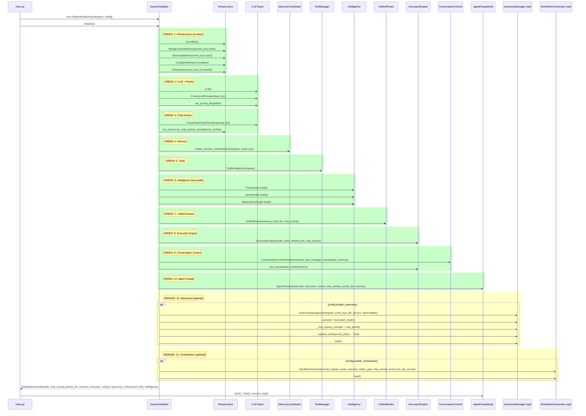

# Freya Architecture Audit — System Overview

**Audit Date:** 2026-08-10  
**Scope:** `app/main.py`, `app/orchestrator/`, `app/agent/`, `app/capabilities/`, `app/memory/` (including `goals/`), `app/events/`, `app/services/`, `app/autonomy/`, `app/diagnostics/`, `app/learning/`, `app/llm/`, `app/tools/`, `app/safe_self_improvement/`, `app/routing/`, `app/execution/`, `app/core/`, `app/conversational_control.py`

---

## 1. System Overview (Verified Wiring)

```mermaid
flowchart TB
    %% Color legend:
    %% GREEN = Working (verified wired and used)
    %% ORANGE = Partial (exists but not fully wired/used)
    %% RED = Broken (referenced but not connected)
    %% GRAY = Legacy/Duplicate (two things doing the same job)

    subgraph CLI["GREEN: CLI Entry"]
        MAIN["main.py\nFreyaApp + argparse"]
    end

    subgraph INIT["GREEN: SystemInitializer\n(app/core/initializer.py)"]
        INIT_ORDER["1. Infrastructure\n2. LLM + Priority\n3. ChatActivity\n4. MemoryCoordinator\n5. ToolManager\n6. Intelligence\n7. UnifiedRouter\n8. ExecutionEngine\n9. ConversationControl\n10. AgentFacadeImpl\n11. AutonomyManager (opt)\n12. WorkflowOrchestrator (opt)"]
    end

    subgraph INFRA["GREEN: Infrastructure"]
        EVENTBUS["EventBus\n(app/core/events.py)"]
        JOBSVC["BackgroundJobService\n(app/core/background_jobs.py)"]
        OBS["ObservabilityHub\n(app/core/observability.py)"]
        CONFIGHR["ConfigHotReload\n(opt)"]
        FWATCH["FileWatcher\n(opt)"]
    end

    subgraph LLM["GREEN: LLM Stack"]
        BASELLM["LLM (Ollama)\n(app/core/llm.py)"]
        PRIOLLM["PriorityLLMProvider\n(app/core/priority_llm.py)\nQueue: CHAT>SAFETY>AUTONOMY>BG"]
        CHATACT["FreyaChatActivityProvider\n(app/core/chat_activity.py)"]
    end

    subgraph MEM["GREEN: Memory"]
        MEMCOORD["MemoryCoordinator\n(app/memory/coordinator.py)\nSingle write path, txn, unified retrieval"]
        subgraph MEM_MODULES["Memory Modules (internal)"]
            WORKING["WorkingMemory"]
            TASK["TaskMemory"]
            LONGTERM["LongTermMemory"]
            EPISODIC["EpisodicMemory"]
            SEMANTIC["SemanticMemory"]
            PROJECT["ProjectMemory"]
        EXPERIENCE["ExperienceMemory"]
        LESSONS["EngineeringLessons"]
        GOALS["GoalStorage"]
        CONV["ConversationMemory"]
        GOALMGR["GoalManager (7 modules)\nmodels, persistence, hierarchy,\nscheduling, analytics, decomposition"]
    end
    end

    subgraph TOOLS["GREEN: Tools"]
        TOOLMGR["ToolManager\n(app/core/tool_manager.py)"]
        FMT["format_tools.py"]
        GIT["git_tools.py"]
        HTTP["http_tools.py"]
    end

    subgraph INTEL["GREEN: Intelligence (built lazily)"]
        PROJIDX["ProjectIndex"]
        SYMIDX["SymbolIndex"]
        FILELOC["FileLocator"]
        LEXSEARCH["LexicalSearch"]
        DEPGRAPH["DependencyGraph"]
        CTXBUILD["ContextBuilder"]
        RETRIEVER["EnhancedRetriever/SimpleRetriever"]
        UNIFIEDRET["UnifiedRetrieval (11 sources)"]
    end

    subgraph ROUTING["GREEN: Routing"]
        UROUTER["UnifiedRouter\n(app/routing/unified_router.py)\nSingle route() call\nIntent + Capability + Control"]
        CAPROUTER["CapabilityRouter\n(app/capabilities/router.py)\nUsed by UnifiedRouter"]
        CAPHANDLERS["Capability Handlers\n(app/capabilities/handlers.py)"]
    end

    subgraph EXEC["GREEN: Execution"]
        EXECENG["ExecutionEngine\n(app/execution/engine.py)\nUnifiedPlanner + UnifiedExecutor\nVerification + RepairLoop"]
        UNIPLAN["UnifiedPlanner\n(wraps agent Planner)"]
        UNIEXEC["UnifiedExecutor\n(wraps agent Executor)"]
        VERIFY["VerificationRunner"]
        REPAIR["RepairLoop + PatchEngine"]
    end

    subgraph CONTROL["GREEN: Conversational Control"]
        CONVCONTROL["ConversationControlHandler\n(app/conversational_control.py)\nstop/cancel/pause/resume/undo/redo/status"]
    end

    subgraph FACADE["GREEN: Agent Facade"]
        FACADEIMPL["AgentFacadeImpl\n(app/agent/facade_impl.py)\nchat(), execute_task(), get_status()"]
        FACADEPROTO["AgentFacade Protocol\n(app/agent/facade.py)"]
    end

    subgraph AUTONOMY["ORANGE: Autonomy (Partial)"]
        AUTOMGR["AutonomyManager\n(app/long_term_autonomy/manager.py)\nDecision loop: observe->analyze->decide->act->verify->learn\nRegisters 7 recurring jobs with JobService"]
        SELFINIT["SelfInitiatedWorkManager"]
        WATCHDOG["Watchdog"]
        MAINT["MaintenanceManager"]
        CONTINUOUS["ContinuousOperationManager"]
    end

    subgraph ORCHESTRATOR["ORANGE: Orchestrator (Partial)"]
        WFORCH["WorkflowOrchestrator\n(app/orchestrator/workflow_orchestrator.py)"]
        WFCOMPOSER["WorkflowComposer"]
        TFEXEC["TaskExecutor"]
        SAFETYGATE["SafetyGate"]
        SELFOBS["SelfObserver"]
        ACTREPORT["ActivityReporter"]
        CAPREG["CapabilityRegistry"]
        FAILREC["FailureRecoveryIntegration"]
    end

    subgraph DIAG["GREEN: Diagnostics"]
        DIAGENG["DiagnosticEngine"]
        ALERT["Alert system"]
        CODEANALYZER["CodeAnalyzer"]
    end

    subgraph LEGACY["GRAY: Legacy / Duplicate"]
        COREAGENT["core_agent.py\nMonolithic agent (1800+ lines)\nNOT used by SystemInitializer"]
        AUTOSCHED["autonomous_learning/scheduler.py\nOld scheduler (duplicate of JobService)"]
        PLANNER_SCHED["planner/scheduler.py\nOld task scheduler"]
        BRAIN["brain/state.py\nConversationState (unused?)"]
        AGENT_EXEC["agent/executor.py\nUsed by UnifiedExecutor (wrapped)"]
        AGENT_PLANNER["agent/planner.py\nUsed by UnifiedPlanner (wrapped)"]
    end

    %% Connections
    MAIN --> INIT
    INIT --> INFRA
    INIT --> LLM
    INIT --> MEM
    INIT --> TOOLS
    INIT --> INTEL
    INIT --> ROUTING
    INIT --> EXEC
    INIT --> CONTROL
    INIT --> FACADE
    INIT -.-> AUTONOMY
    INIT -.-> ORCHESTRATOR

    INFRA --> EVENTBUS
    INFRA --> JOBSVC
    INFRA --> OBS

    BASELLM --> PRIOLLM
    PRIOLLM --> CHATACT
    CHATACT -.-> JOBSVC
    CHATACT -.-> AUTOMGR

    MEMCOORD --> EVENTBUS
    MEMCOORD --> MEM_MODULES
    MEMCOORD --> UNIFIEDRET
    MEMCOORD --> GOALMGR
    GOALMGR --> EVENTBUS
    GOALMGR --> JOBSVC

    UROUTER --> MEMCOORD
    UROUTER --> TOOLMGR
    UROUTER --> PRIOLLM
    UROUTER --> CHATACT
    UROUTER --> CAPROUTER
    CAPROUTER --> CAPHANDLERS

    EXECENG --> UROUTER
    EXECENG --> TOOLMGR
    EXECENG --> MEMCOORD
    EXECENG --> PRIOLLM
    EXECENG --> CHATACT
    EXECENG --> UNIPLAN
    EXECENG --> UNIEXEC
    UNIPLAN --> AGENT_PLANNER
    UNIEXEC --> AGENT_EXEC
    EXECENG --> VERIFY
    EXECENG --> REPAIR

    CONVCONTROL --> EXECENG
    CONVCONTROL --> EVENTBUS
    CONVCONTROL --> JOBSVC
    CONVCONTROL --> OBS

    FACADEIMPL --> UROUTER
    FACADEIMPL --> EXECENG
    FACADEIMPL --> CONVCONTROL
    FACADEIMPL --> CHATACT
    FACADEIMPL --> PRIOLLM
    FACADEIMPL --> MEMCOORD
    FACADEPROTO -.-> FACADEIMPL

    AUTOMGR --> JOBSVC
    AUTOMGR --> EVENTBUS
    AUTOMGR --> OBS
    AUTOMGR -.-> EXECENG
    AUTOMGR -.-> UROUTER
    AUTOMGR -.-> MEMCOORD
    AUTOMGR -.-> CHATACT
    AUTOMGR -.-> PRIOLLM

    WFORCH --> CAPREG
    WFORCH --> UROUTER
    WFORCH --> EXECENG
    WFORCH --> SAFETYGATE
    WFORCH --> CHATACT
    WFORCH --> EVENTBUS
    WFORCH --> JOBSVC
    WFORCH --> FAILREC

    COREAGENT -.-> "NOT wired"
    AUTOSCHED -.-> "Superseded by JobService"
```

---

## 2. Startup / Initialization Flow



---

## 3. Request Flow (User Input to Response)

```mermaid
sequenceDiagram
    participant User
    participant App as FreyaApp
    participant Facade as AgentFacadeImpl
    participant ChatAct as FreyaChatActivityProvider
    participant Router as UnifiedRouter
    participant CapRouter as CapabilityRouter
    participant Control as ConversationControlHandler
    participant Exec as ExecutionEngine
    participant PriLLM as PriorityLLMProvider

    User->>App: chat("user input") or execute_task()
    App->>Facade: chat(user_input) / execute_task(task)
    
    Facade->>ChatAct: chat_started()
    
    alt execute_task (bypass router)
        Facade->>Exec: execute_plan(task, allow_mutations)
        Exec->>PriLLM: ask(prompt, priority=CHAT) for summary
        Exec-->>Facade: result string
    else chat (routed)
        Facade->>Router: route(user_input)
        
        Router->>Control: ControlCommandParser.parse(user_input)
        alt Control command detected
            Router-->>Facade: RouteResult(is_control=True, control_command)
            Facade->>Control: handle_stop/cancel/pause/resume/undo/redo/status
            Control-->>Facade: result message
        else Intent classification
            Router->>Router: IntentClassifier.classify()
            
            alt Capability match (SYSTEM_STATUS, CHAT, QUESTION)
                Router->>CapRouter: find_matching()
                CapRouter-->>Router: (capability_name, confidence)
                Router-->>Facade: RouteResult(is_direct_answer=True, capability_name)
                Facade->>Router: execute_capability(capability_name, user_input)
                CapRouter->>CapRouter: handler(ctx)
                CapRouter-->>Facade: CapabilityResult(message)
            else Clarification needed
                Router-->>Facade: RouteResult(is_clarification=True)
                Facade->>Facade: _ask_clarification() via intent classifier
            else Direct answer (non-engineering)
                Router-->>Facade: RouteResult(is_direct_answer=True)
                Facade->>PriLLM: ask(prompt, system_prompt, priority=CHAT)
                PriLLM-->>Facade: LLM response
            else Engineering task
                Router-->>Facade: RouteResult(is_engineering=True)
                Facade->>Exec: execute_plan(user_input)
                Exec->>Mem: retrieve_for_planning(task)
                Exec->>UniPlanner: create_plan(task, context)
                Exec->>UniExecutor: execute(plan)
                UniExecutor->>AgentExecutor: execute_task(task, allowed_tools)
                UniExecutor->>Verify/Repair: verify/repair
                UniExecutor->>PriLLM: ask(summary_prompt, priority=CHAT)
                Exec-->>Facade: summary string
        end
    end
    
    Facade->>ChatAct: chat_ended()
    Facade-->>App: response string
    App-->>User: print(response)
```

---

## 4. Background / Autonomy Flow

```mermaid
sequenceDiagram
    participant JobSvc as BackgroundJobService
    participant ChatAct as FreyaChatActivityProvider
    participant Autonomy as AutonomyManager
    participant Watchdog as Watchdog
    participant Learning as LearningPipeline
    participant SelfWork as SelfInitiatedWorkManager
    participant Maint as MaintenanceManager
    participant EventBus as EventBus
    participant ExecEng as ExecutionEngine
    participant Router as UnifiedRouter

    Note over JobSvc: Scheduler Loop (tick=1s)
    loop Every tick
        JobSvc->>ChatAct: is_chat_active()
        alt Chat active
            JobSvc->>ChatAct: wait_for_chat_idle(timeout=60s)  -- YIELDS to chat
            JobSvc->>JobSvc: continue (re-check)
        else Chat idle
            JobSvc->>JobSvc: _get_ready_jobs(now)
            JobSvc->>JobSvc: _worker_semaphore.acquire()
            JobSvc->>JobSvc: _execute_job(job) in worker thread
        end
    end

    Note over Autonomy: Registered Jobs (via _register_background_jobs)
    Autonomy->>JobSvc: schedule("autonomy_persist_state", _autonomy_persist_state, 300s, LOW)
    Autonomy->>JobSvc: schedule("autonomy_learning_pipeline", _run_learning_pipeline_job, config.learning_interval, NORMAL)
    Autonomy->>JobSvc: schedule("autonomy_maintenance", _autonomy_maintenance_job, 3600s, LOW)
    Autonomy->>JobSvc: schedule("autonomy_watchdog_checkpoint", _autonomy_watchdog_checkpoint, config.watchdog_checkpoint_interval, HIGH)
    Autonomy->>JobSvc: schedule("autonomy_self_initiated_work", _autonomy_self_initiated_work_job, config.self_initiated_work_interval, NORMAL)
    Autonomy->>JobSvc: schedule("autonomy_health_check", _autonomy_health_check_job, 60s, NORMAL)
    Autonomy->>JobSvc: schedule("autonomy_persist_state_5min", _autonomy_persist_state, 300s, LOW)

    Note over Autonomy: Decision Loop (main thread)
    Autonomy->>Autonomy: _coordination_loop()  -- daemon thread
    loop While running
        Autonomy->>ChatAct: is_chat_active() / wait_for_chat_idle()  -- YIELDS to chat
        Autonomy->>Autonomy: _run_autonomy_cycle()
        Autonomy->>Autonomy: OBSERVE -> ANALYZE -> DECIDE -> ACT -> VERIFY -> LEARN
        
        alt ACT: execute specific task
            Autonomy->>ExecEng: execute_plan(task)  -- via executor if set
        alt ACT: create goal
            Autonomy->>Autonomy: goal_storage.create()
        alt ACT: review stalled goals
            Autonomy->>Autonomy: goal_storage.pause_goal/decompose
        end
        
        Autonomy->>EventBus: emit("autonomy.cycle.completed", data)
    end

    Note over Orchestrator: Optional background work
    Orchestrator->>ChatAct: is_chat_active() in coordination loop (NOT IMPLEMENTED YET)
    Orchestrator->>JobSvc: _start_background_jobs()  -- EMPTY
```

---

## 5. Verified Wiring Checklist

| Connection | Status | Evidence |
|---|---|---|
| `EventBus.subscribe()` called | GREEN **Yes** | `app/agent/core_agent.py:692-695`, `app/core/file_watcher.py:391-472`, `app/decision/learning_module.py:283-291`, `app/diagnostics/alert.py:299-301`, `app/knowledge_acquisition/pipeline.py:998-999`, `app/orchestrator/activity_reporter.py:94-124`, `app/orchestrator/self_observer.py:237-254`, `app/self_observation/*.py` (10+ files) |
| `SchedulerService` exists | RED **No** | No `SchedulerService` class found. **`BackgroundJobService`** is the unified scheduler (`app/core/background_jobs.py`) |
| `AutonomyEngine` exists | RED **No** | No `AutonomyEngine` class. **`AutonomyManager`** (`app/long_term_autonomy/manager.py`) is the main class |
| `AutonomyManager` to `BackgroundJobService` | GREEN **Yes** | `AutonomyManager._register_background_jobs()` calls `job_service.schedule()` for 7 jobs (line 346-368) |
| `BackgroundJobService` yields to chat | GREEN **Yes** | `BackgroundJobService._scheduler_loop()` checks `chat_activity_provider.is_chat_active()` and calls `wait_for_chat_idle()` (lines 424-433) |
| `AutonomyManager` yields to chat | GREEN **Yes** | `AutonomyManager._autonomy_loop()` checks `chat_activity_provider.is_chat_active()` and calls `wait_for_chat_idle()` (lines 694-703) |
| `CoreAgent` consumes streaming | RED **No** | `CoreAgent.chat()` not found; `AgentFacadeImpl.chat()` returns `str`, no async/streaming. `PriorityLLMProvider.ask()` is synchronous. `OrchestratorStreamingInterface` exists but unused by Facade |
| `UnifiedRouter` is single route() | GREEN **Yes** | `UnifiedRouter.route()` returns complete `RouteResult` in one call (lines 130-198) |
| `MemoryCoordinator` single write path | GREEN **Yes** | All writes go through `MemoryCoordinator` methods with `_lock` (lines 90-130) |
| `ExecutionEngine` unified pipeline | GREEN **Yes** | `ExecutionEngine` composes `UnifiedPlanner` + `UnifiedExecutor` + `VerificationRunner` + `RepairLoop` |
| `CapabilityRouter` used by `UnifiedRouter` | GREEN **Yes** | `UnifiedRouter.__init__` creates `CapabilityRouter` and delegates `find_matching`/`execute_capability` |
| `ConversationControl` wired to `ExecutionEngine` | GREEN **Yes** | `SystemInitializer` creates `ConversationControlHandler(executor=execution_engine)` and calls `execution_engine.set_conversation_control()` (lines 215-218) |
| `WorkflowOrchestrator` uses shared `router`/`executor` | GREEN **Yes** | `SystemInitializer` passes `unified_router` and `execution_engine` to `WorkflowOrchestrator` (lines 243-250) |
| `SafetyGate` used by Orchestrator | GREEN **Yes** | `WorkflowOrchestrator` constructs `SafetyGate` and exposes `check_safety()` method |

---

## 6. Components In Code But Undocumented (No Prior Docs Found)

| Component | Location | Notes |
|---|---|---|
| `FreyaChatActivityProvider` | `app/core/chat_activity.py` | Central chat activity signaling; used by JobService, AutonomyManager, PriorityLLMProvider |
| `PriorityLLMProvider` + `LLMPriority` | `app/core/priority_llm.py` | 4-level priority queue with preemption; core of chat-first architecture |
| `UnifiedRouter` | `app/routing/unified_router.py` | Consolidates intent classification + capability routing + control parsing |
| `ExecutionEngine` | `app/execution/engine.py` | Single execution pipeline merging planner + executor + verification + repair |
| `AgentFacadeImpl` | `app/agent/facade_impl.py` | Thin (< 500 lines) public API; sole implementation of `AgentFacade` protocol |
| `ConversationControlHandler` | `app/conversational_control.py` | Centralized stop/cancel/pause/resume/undo/redo/status with shared infra |
| `MemoryCoordinator` | `app/memory/coordinator.py` | Transactional single-write facade over 10 memory modules |
| `BackgroundJobService` | `app/core/background_jobs.py` | Consolidates 3 old schedulers; chat-aware yielding via Condition variable |
| `SystemInitializer` | `app/core/initializer.py` | Single-pass dependency-ordered construction; breaks circular deps |
| `SafetyPromotionGates` | `app/core/safety_gates.py` | Reusable safety evaluation with risk assessment, gates, promotion decisions |

---

## 7. Components Documented Elsewhere But Missing In Code

| Referenced Component | Expected Location | Actual Status |
|---|---|---|
| `SchedulerService` | `app/services/` or `app/core/` | **Not found** — superseded by `BackgroundJobService` |
| `AutonomyEngine` | `app/autonomy/` | **Not found** — actual class is `AutonomyManager` in `app/long_term_autonomy/` |
| `app/capabilities/base.py` | `app/capabilities/base.py` | **Not found** — capabilities use dataclass `Capability` in `router.py` |
| `app/llm/provider_factory.py` | `app/llm/provider_factory.py` | **Not found** — LLM is hardcoded Ollama in `app/core/llm.py` |
| `app/safety/` directory | `app/safety/` | **Not found** — safety code is in `app/core/safety_gates.py` and `app/orchestrator/safety_gate.py` |
| `CoreAgent` as primary agent | `app/agent/core_agent.py` | **Exists but NOT used** by `SystemInitializer`; legacy monolith |

---

## 8. Legacy / Duplicate Components (Gray Nodes)

| Component | Duplicate Of | Status |
|---|---|---|
| `app/agent/core_agent.py` (1800+ lines) | `AgentFacadeImpl` + `ExecutionEngine` + `UnifiedRouter` + `MemoryCoordinator` | **Legacy** — not instantiated by `SystemInitializer`; retains old monolithic architecture |
| `app/autonomous_learning/scheduler.py` | `BackgroundJobService` | **Legacy** — old autonomous learning scheduler; `AutonomyManager` now uses `JobService` |
| `app/planner/scheduler.py` | `BackgroundJobService` | **Legacy** — old task scheduler; unused by new pipeline |
| `app/agent/executor.py` | `UnifiedExecutor` (wraps it) | **Wrapped** — `UnifiedExecutor` delegates to `AgentExecutor` |
| `app/agent/planner.py` | `UnifiedPlanner` (wraps it) | **Wrapped** — `UnifiedPlanner` delegates to `AgentPlanner` |
| `app/brain/state.py` | `ConversationMemory` | **Likely unused** — `ConversationState` not referenced in new pipeline |
| `CapabilityRouter` (in capabilities/) | `UnifiedRouter` uses it internally | **Internal** — not a duplicate, but not directly exposed |

---

## 9. Color-Code Summary

| Color | Meaning | Count |
|---|---|---|
| GREEN **Green** | Verified wired and used | 18 core components |
| ORANGE **Orange** | Partial — optional, not fully exercised, or wiring incomplete | 2 (AutonomyManager, WorkflowOrchestrator) |
| RED **Red** | Referenced but not connected / missing | 3 (SchedulerService, AutonomyEngine, CoreAgent streaming) |
| GRAY **Gray** | Legacy / duplicate — two things doing same job | 7 components |

---

*Generated by architecture audit — source of truth is code only. No external documentation was trusted.*
