# Freya Current Architecture

*Generated from codebase analysis on 2026-08-13*

This document represents the **actual current architecture** of the Freya codebase at `C:\AI Projects\Freya`.

```mermaid
flowchart TD


%% =========================================================
%% 1. BOOTSTRAP
%% =========================================================
subgraph BOOT["1. BOOTSTRAP"]
direction TB


A["main.py"]
B["FreyaApp"]
C["SystemInitializer"]


A --> B
B --> C
end



%% =========================================================
%% 2. PUBLIC INTERFACE
%% =========================================================
subgraph INTERFACE["2. PUBLIC INTERFACE"]
direction TB


K["AgentFacadeImpl"]
J["ConversationControlHandler"]


K --> J
end



%% =========================================================
%% 3. SHARED INFRASTRUCTURE
%% =========================================================
subgraph INFRA["3. SHARED INFRASTRUCTURE"]
direction TB


EV["EventBus"]
JB["BackgroundJobService"]
OH["ObservabilityHub"]
CHR["ConfigHotReload"]
FW["FileWatcher"]


EV --> JB
EV --> OH
EV --> CHR
EV --> FW
end



%% =========================================================
%% 4. LLM STACK
%% =========================================================
subgraph LLM["4. LLM STACK"]
direction TB


D["LLMStack"]
D2["PriorityLLMProvider"]
D1["Ollama / Local Model"]
D3["ChatActivityProvider"]


D --> D2
D --> D3
D2 --> D1
end



%% =========================================================
%% 5. MEMORY SYSTEM
%% =========================================================
subgraph MEMORY["5. MEMORY SYSTEM"]
direction TB


E["MemoryCoordinator"]
E3["UnifiedRetrieval"]
E2["GoalStorage"]
E1["Core Memory Modules<br/>Working · Task · Long-Term<br/>Episodic · Semantic · Project"]
E4["ExperienceMemory"]
E5["ConversationMemory"]
E6["EngineeringLessons"]
CN["ConsolidationEngine"]
FG["ForgettingEngine"]


E --> E3
E --> E2
E --> E1
E --> E4
E --> E5
E --> E6
E --> CN
E --> FG

E3 --> E1
E3 --> E4
E3 --> E5
E3 --> E6
end



%% =========================================================
%% 6. INTELLIGENCE ENGINE
%% =========================================================
subgraph INTELLIGENCE["6. INTELLIGENCE ENGINE"]
direction TB


G["Intelligence"]
G1["Reasoning + Decision Logic"]
G2["Confidence / Answerability Assessment"]
G3["Context + Goal Awareness"]


G --> G1
G --> G2
G --> G3
end



%% =========================================================
%% 7. KNOWLEDGE-FIRST RESOLUTION
%% =========================================================
subgraph ROUTING["7. KNOWLEDGE-FIRST ROUTING"]
direction TB


H["UnifiedRouter"]
H0["KnowledgeFirstResolver"]
H5{"Can Freya Answer?"}
H6{"Local Capability Available?"}
RESULT["Freya Answer"]


H --> H0


H5 -->|"Yes"| RESULT


H5 -->|"No / Insufficient"| H6
end



%% =========================================================
%% 8. MODULAR CAPABILITY SYSTEM
%% =========================================================
subgraph CAPABILITY["8. MODULAR CAPABILITY SYSTEM"]
direction TB


M2["CapabilityRegistry"]
H1["CapabilityRouter"]
H2["Capability Handlers"]
F["ToolManager"]


M2 --> H1
H1 --> H2
H2 --> F
end



%% =========================================================
%% 9. VERIFICATION LAYER
%% =========================================================
subgraph VERIFICATION["9. VERIFICATION LAYER"]
direction TB


V1["AnswerVerifier"]
AR["AnswerRepairLoop"]
SF1["AnswerSafeFailure"]
LP["LearningPipeline"]


V1 --> AR
V1 --> SF1
SF1 --> LP
AR --> D2
end



%% =========================================================
%% 10. WORKFLOW + EXECUTION
%% =========================================================
subgraph EXECUTION["10. WORKFLOW + EXECUTION"]
direction TB


M["WorkflowOrchestrator"]
M1["SafetyGate"]


I["ExecutionEngine"]
I1["UnifiedPlanner"]
I2["UnifiedExecutor"]
I3["ExecutionVerifier"]
I4["RepairLoop"]


DONE["Task Complete"]
SF2["ExecutionSafeFailure"]
Q1["DiagnosticEngine"]


M --> M1


I --> I1
I1 --> I2
I2 --> I3


I3 -->|"Passed"| DONE


I3 -->|"Failed"| I4
I4 -->|"Repair / Replan (Attempt < Max)"| I1
I4 -->|"Retries Exhausted"| SF2
SF2 -->|"Request Compensation"| M1
SF2 -->|"Partial Failure Report"| J
SF2 -->|"Log Failure Pattern"| Q1
end



%% =========================================================
%% 11. LEARNING PIPELINE
%% =========================================================
subgraph LEARNING["11. LEARNING PIPELINE"]
direction TB


LP2["LearningPipeline"]
LP1["Observe"]
LP2a["Evaluate"]
LP3["Extract Learning"]
LP4["Validate Learning"]
LP5{"Worth Remembering?"}


TEMP["Discard / Keep Temporary"]


LP2 --> LP1
LP1 --> LP2a
LP2a --> LP3
LP3 --> LP4
LP4 --> LP5


LP5 -->|"No"| TEMP
LP5 -->|"Yes"| E
end



%% =========================================================
%% 12. AUTONOMY + OBSERVATION
%% =========================================================
subgraph AUTONOMY["12. AUTONOMY + OBSERVATION"]
direction TB


L["AutonomyManager"]


L1["Watchdog"]
L3["SelfInitiatedWorkManager"]
L4["MaintenanceManager"]


L --> L1
L --> L3
L --> L4
end



%% =========================================================
%% 13. SAFE SELF-IMPROVEMENT
%% =========================================================
subgraph IMPROVEMENT["13. SAFE SELF-IMPROVEMENT"]
direction TB


Q1b["DiagnosticEngine"]
Q2["SafeSelfImprovementEngine"]


Q1b --> Q2
end



%% =========================================================
%% 14. FUTURE EXTENSION PORTS
%% =========================================================
subgraph EXTENSIONS["14. FUTURE EXTENSION PORTS"]
direction TB


X["Future Capability / Feature"]


X1["Callable Capability"]
X2["Event / Observer"]
X3["Background / Autonomous"]
X4["Memory-Aware Feature"]


X --> X1
X --> X2
X --> X3
X --> X4
end



%% =========================================================
%% CROSS-GROUP WIRING (COMPLETE & VALIDATED)
%% =========================================================


%% --- Bootstrap Sequence ---
C -->|"1. Init Infrastructure"| EV
C -->|"1. Init Infrastructure"| JB
C -->|"1. Init Infrastructure"| OH
C -->|"1. Init Infrastructure"| CHR
C -->|"1. Init Infrastructure"| FW

C -->|"2. Init LLM Stack"| D

C -->|"3. Init Memory"| E

C -->|"3b. Init Learning Pipeline"| LP2

C -->|"3c. Init Answer Verifier (V1+AR+SF1)"| V1

C -->|"4. Init Tool Manager"| F

C -->|"5. Init Intelligence (G1+G2+G3)"| G

C -->|"6. Init Capability Registry"| M2

C -->|"7. Init Safety Gate"| M1

C -->|"8. Init Unified Router (with KnowledgeFirstResolver)"| H

C -->|"9. Init Execution Engine (Planner/Executor/Verifier/Repair)"| I

C -->|"10. Init Conversation Control"| J

C -->|"11. Init Agent Facade"| K

C -.->|"12. Optional: Init Autonomy"| L
C -.->|"13. Optional: Init Diagnostics"| Q1b
C -.->|"14. Optional: Init Safe Self-Improvement"| Q2
C -.->|"15. Optional: Init Orchestrator"| M


%% --- Goal & Context wiring ---
E2 -->|"Active Goals"| G3
E2 -->|"Goal Context"| I1

E3 -->|"Retrieved Knowledge"| G
E3 -->|"Knowledge / Experience"| H5

G -->|"Intent / Plan Hints"| I1
G1 -->|"Reasoned Decisions"| I1
G2 -->|"Confidence Score"| H5
G3 -->|"Context Snapshot"| I1


%% --- Shared Infrastructure wiring ---
M -->|"Events / Commands"| EV
M -->|"Schedule Background"| JB
I -->|"Metrics / Traces"| OH

EV -->|"System Events"| L1
EV -->|"Learning Events"| LP2
EV -->|"Autonomy Triggers"| L3
EV -->|"Maintenance Triggers"| L4

OH -->|"Metrics / Health"| L1
OH -->|"Diagnostics Data"| Q1b
OH -->|"Execution Metrics"| M

L -->|"Background Jobs"| JB


%% --- Knowledge-First Routing ---
H0 -->|"1. Search Freya First"| E3
H5 -->|"Yes, High Confidence"| RESULT
H5 -->|"No / Insufficient"| H6

H6 -->|"Yes"| H1
H6 -->|"No"| D2


%% --- LLM Fallback & Verification ---
D2 -->|"Fallback Answer"| V1

V1 -->|"Valid Answer"| RESULT
V1 -->|"Learning Candidate"| LP2

AR -->|"Retry w/ Corrective Context (Attempt < Max)"| D2
SF1 -->|"Low-Confidence Disclosure"| RESULT
SF1 -->|"Log Knowledge Gap"| LP2


%% --- Learning to Memory ---
LP5 -->|"Yes, Store"| E
LP2 -->|"Learning Events"| EV


%% --- Planner asks Freya knowledge first ---
I1 -->|"Knowledge/Capability Query"| H


%% --- Execution uses Capability System ---
I2 -->|"Proposed Action"| M1
M1 -->|"Approved Action"| H1
H1 -->|"Dispatch"| H2
H2 -->|"Execute Tool"| F
F -->|"Tool Result"| I2


%% --- Execution Verification & Repair ---
I3 -->|"Passed"| DONE
I3 -->|"Failed / Partial"| I4
I4 -->|"Repair / Replan (Attempt < Max)"| I1
I4 -->|"Retries Exhausted"| SF2
SF2 -->|"Request Compensation"| M1
SF2 -->|"Partial Failure Report"| J
SF2 -->|"Log Failure Pattern"| Q1b


%% --- Conversation Flow Wiring ---
J -->|"Question / Knowledge Request"| H
J -->|"Task / Action Request"| M
J -->|"Context / Memory Read"| E
J -->|"Intelligence Context"| G
J -->|"Chat Activity"| D3
J -->|"Goal Updates"| E2

RESULT -->|"Final Answer"| J
DONE -->|"Task Result"| J


%% --- Autonomy + Observation Wiring ---
L3 -->|"Read Goals"| E2
L3 -->|"Autonomous Work Request"| M
L4 -->|"Maintenance Work Request"| M

L1 -->|"Observations / Anomalies"| LP2
L1 -->|"Health Events"| EV


%% --- Safe Self-Improvement Wiring ---
LP2 -->|"Improvement Candidate"| Q2
Q2 -->|"Approved Improvement Proposal"| M
Q1b -->|"Failure Patterns"| Q2
Q1b -->|"Diagnostics Data"| Q2


%% --- Future Extension Ports Wiring ---
X1 -.->|"Register Capability"| M2
X2 -.->|"Publish / Subscribe"| EV
X3 -.->|"Schedule Background"| JB
X4 -.->|"Stable Memory API"| E


%% =========================================================
%% STYLING
%% =========================================================


classDef bootstrap fill:#263238,color:#ffffff,stroke:#546e7a,stroke-width:2px;
classDef interface fill:#6a1b9a,color:#ffffff,stroke:#ab47bc;
classDef memory fill:#00695c,color:#ffffff,stroke:#26a69a,stroke-width:2px;
classDef intelligence fill:#1565c0,color:#ffffff,stroke:#42a5f5;
classDef routing fill:#00838f,color:#ffffff,stroke:#26c6da;
classDef capability fill:#0277bd,color:#ffffff,stroke:#29b6f6;
classDef llm fill:#4527a0,color:#ffffff,stroke:#7e57c2;
classDef learning fill:#558b2f,color:#ffffff,stroke:#9ccc65;
classDef execution fill:#2e7d32,color:#ffffff,stroke:#66bb6a;
classDef workflow fill:#ef6c00,color:#ffffff,stroke:#ffa726;
classDef safety fill:#c62828,color:#ffffff,stroke:#ef5350,stroke-width:3px;
classDef infrastructure fill:#37474f,color:#ffffff,stroke:#78909c;
classDef improvement fill:#ad1457,color:#ffffff,stroke:#ec407a;
classDef extension fill:#455a64,color:#ffffff,stroke:#90a4ae,stroke-dasharray:5 5;
classDef verification fill:#b71c1c,color:#ffffff,stroke:#ef5350,stroke-width:2px;
classDef optional fill:#1a237e,color:#ffffff,stroke:#3f51b5,stroke-dasharray:5 5;


class A,B,C bootstrap;
class K,J interface;
class EV,JB,OH,CHR,FW infrastructure;
class D,D1,D2,D3 llm;
class E,E1,E2,E3,E4,E5,E6,CN,FG memory;
class G,G1,G2,G3 intelligence;
class H,H0,H5,H6,RESULT routing;
class M2,H1,H2,F capability;
class V1,AR,SF1 verification;
class LP2,LP1,LP2a,LP3,LP4,LP5,TEMP learning;
class I,I1,I2,I3,I4,DONE execution;
class M,L,L1,L3,L4 workflow;
class M1,SF2,Q1b safety;
class Q1b,Q2 improvement;
class X,X1,X2,X3,X4 extension;
class L,C,D,D2,E,E3,G,G2,H,H0,H1,I,I1,I2,I3,I4,J,K,M,M1,M2,V1,LP2,LP5,Q1b,Q2 optional;
```

---

## Architecture Summary

| Layer | Key Components | Purpose |
|-------|---------------|---------|
| **1. Bootstrap** | `main.py` → `FreyaApp` → `SystemInitializer` | Thin launcher; single-pass construction of all subsystems |
| **2. Public Interface** | `AgentFacadeImpl`, `ConversationControlHandler` | Thin façade & conversational control (stop/pause/undo/status) |
| **3. Shared Infrastructure** | `EventBus`, `BackgroundJobService`, `ObservabilityHub`, `ConfigHotReload`, `FileWatcher` | Cross-cutting services; no deps, initialized first |
| **4. LLM Stack** | `LLMStack`, `PriorityLLMProvider`, `Ollama`, `ChatActivityProvider` | Local LLM with priority queue; chat-aware yielding |
| **5. Memory System** | `MemoryCoordinator`, `UnifiedRetrieval`, 7 memory modules, `ConsolidationEngine`, `ForgettingEngine` | Single write path; transactional; cache invalidation |
| **6. Intelligence Engine** | `Intelligence` (G1/G2/G3) | Context eval, confidence/answerability, goal awareness |
| **7. Knowledge-First Routing** | `UnifiedRouter` + `KnowledgeFirstResolver` | Search Freya first → capability → LLM fallback |
| **8. Modular Capability System** | `CapabilityRegistry`, `CapabilityRouter`, Handlers, `ToolManager` | Extensible capabilities; tools execute via ToolManager |
| **9. Verification Layer** | `AnswerVerifier`, `AnswerRepairLoop`, `AnswerSafeFailure` | LLM fallback verification with repair & low-confidence disclosure |
| **10. Workflow + Execution** | `WorkflowOrchestrator`, `SafetyGate`, `ExecutionEngine` (Planner/Executor/Verifier/Repair) | Plan→Execute→Verify→Repair loop with safety gates |
| **11. Learning Pipeline** | `LearningPipeline` (Observe→Evaluate→Extract→Validate→Store) | Autonomous learning from execution outcomes |
| **12. Autonomy + Observation** | `AutonomyManager` (Watchdog, SelfInitiatedWork, Maintenance) | Long-running autonomous operation |
| **13. Safe Self-Improvement** | `DiagnosticEngine`, `SafeSelfImprovementEngine` | Diagnostics → approved proposals → orchestrated improvements |
| **14. Future Extension Ports** | Capability, Event, Background, Memory-Aware interfaces | Stable ports for future features |

---

## Initialization Order (from `SystemInitializer.initialize()`)

1. **Infrastructure** — `EventBus`, `BackgroundJobService`, `ObservabilityHub`, `ConfigHotReload`, `FileWatcher`
2. **LLM Stack** — `LLMStack` (PriorityLLMProvider + ChatActivityProvider)
3. **Memory Coordinator** — all 7 memory modules + UnifiedRetrieval
4. **Learning Pipeline** — depends on MemoryCoordinator + EventBus
5. **Answer Verifier** — depends on LearningPipeline + PriorityLLMProvider
6. **Tool Manager** — workspace-scoped tool execution
7. **Intelligence** — depends on UnifiedRetrieval, GoalStorage, ConversationMemory
8. **Capability Registry** — registers built-in capabilities
9. **Safety Gate** — required for ExecutionEngine/Orchestrator
10. **Unified Router** — with KnowledgeFirstResolver (memory, tools, LLM, chat_activity, unified_retrieval, intelligence, llm_stack)
11. **Execution Engine** — router, tools, memory, LLM, chat_activity, safety_gate
12. **Conversation Control** — executor, plan_manager, conversation_memory
13. **Agent Facade** — composes router, execution, control, chat_activity, priority_llm, memory, answer_verifier
14. **Optional: Autonomy Manager** — executor, router, memory, chat_activity, priority_llm, event_bus, job_service
15. **Optional: Diagnostic Engine** — workspace, event_bus
16. **Optional: Safe Self-Improvement Engine** — event_bus, workspace
17. **Optional: Workflow Orchestrator** — capability_registry, router, executor, safety_gate, chat_activity, event_bus, job_service

---

## Key Architectural Decisions (from codebase)

1. **Single-Pass Initialization** — `SystemInitializer` breaks circular deps by composing in strict order; no component holds `FreyaAgent` reference
2. **Protocol-Based Dependencies** — Cross-component deps use protocols (`MemoryProvider`, `ToolProvider`, `RouterProtocol`, `ExecutorProvider`)
3. **Knowledge-First Routing** — `KnowledgeFirstResolver` searches Freya memory first; only falls back to capabilities/LLM when insufficient
4. **Unified Router** — Single `route()` call returns complete decision (control/capability/direct/engineering/clarification)
5. **Verification Layer** — `AnswerVerifier` wraps LLM fallback with repair loop (`AnswerRepairLoop`) and safe failure (`AnswerSafeFailure`)
6. **Execution Repair Loop** — `ExecutionEngine` has Planner→Executor→Verifier→RepairLoop with configurable max retries
7. **Single Write Path** — `MemoryCoordinator` provides transactional writes with lock; all mutations emit events
8. **Chat-Aware Yielding** — `BackgroundJobService` uses `ChatActivityProvider` for cooperative yielding during active chat
9. **Optional Subsystems** — Autonomy, Diagnostics, Self-Improvement, Orchestrator gated by `SystemConfig` flags
10. **Future-Proof Extension Ports** — Dashed interfaces for Capability/Event/Background/Memory registration