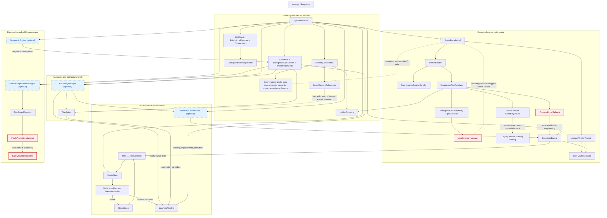

# Current Freya Production Architecture

*Verified against the current codebase on 2026-08-14.*

This diagram documents the runtime assembled by `main.py` → `FreyaApp` → `SystemInitializer`. **Solid lines** are implemented production wiring. **Dashed red lines** mark active defects in otherwise instantiated paths; they are deliberately shown so the document does not present the target architecture as working.

## Runtime composition and actual return paths

| Area | Current production relationship |
|---|---|
| **Bootstrap** | `SystemInitializer` binds the shared event bus, job service, observability hub, LLM stack, memory coordinator, learning pipeline, answer verifier, tools, intelligence, router, execution engine, conversation control, facade, and enabled optional subsystems. The workflow orchestrator is started before the autonomy manager. |
| **Local-first resolution** | `KnowledgeFirstResolver` retrieves memory and asks `Intelligence` for answerability. It can construct an internal `ResolutionResult.answer`, a capability result, or an LLM fallback prompt. The router currently discards the answer/prompt payload when converting to `RouteResult`; this is an active production defect, not an omitted diagram edge. |
| **Conversation output** | The facade sends direct answers through the priority provider and answer verifier, handles controls through `ConversationControlHandler`, and sends engineering routes to `ExecutionEngine`. The facade currently does not write supported user/assistant exchanges through `MemoryCoordinator.record_conversation()`. |
| **Execution** | `ExecutionEngine` plans, safety-checks, executes, verifies, attempts repair on verification failure, records a terminal plan state, and hands terminal outcomes to `LearningPipeline` through `ExecutionVerifier`. `WorkflowOrchestrator` uses the same execution engine and safety gate. |
| **Memory and learning** | `MemoryCoordinator` owns durable stores, unified retrieval, conversation memory, and cross-memory references. `LearningPipeline` persists accepted items through the coordinator. When autonomy is enabled, the autonomy manager starts the pipeline's background queue drain. |
| **Autonomy** | `AutonomyManager` starts watchdog, self-initiated-work, and maintenance components and uses the shared job service and orchestrator. The watchdog observes `memory.*`; derived cross-reference writes are currently not all excluded, leaving a real feedback risk into learning. |
| **Self-improvement** | `LearningPipeline` and diagnostics publish shared events. `SafeSelfImprovementEngine` receives them and auto-executes learning-origin candidates with its own risk executor and promotion manager; it does **not** route those candidates through `WorkflowOrchestrator`. The promotion manager's safety-gate call is currently incompatible with the instantiated gate API. |

## Deliberately omitted from the active diagram

The legacy `FreyaAgent`, `long_term_autonomy`, and experimental/legacy retrieval subsystems exist in the repository but are not created by `SystemInitializer` or reached by the supported `FreyaApp` path. They are therefore not represented as current production architecture.

## Verified initialization order

1. Shared infrastructure: event bus, job service, observability, optional hot reload, and optional file watcher.
2. `LLMStack`, followed by memory coordinator, learning pipeline, and answer verifier.
3. Tool manager, intelligence, separate orchestrator capability registry, and safety gate.
4. Router, execution engine, conversation control, and facade.
5. Optional workflow orchestrator, optional autonomy manager, diagnostics, and safe self-improvement engine.
6. Readiness checks are registered and immediately evaluated before the initialized system is returned.

> **Current limitations shown above are implementation defects, not future design proposals.** Their required remediation and verification are defined in [`PROJECT_STATUS.md`](PROJECT_STATUS.md).
