# Freya Current Architecture

**Status:** Current implemented architecture

**Source of truth:** Production codebase and verified canonical runtime wiring

**Version:** V2 baseline
**Repository revision inspected:** `03b0a78`

> This document describes what the current production code constructs, injects, subscribes, starts, routes, verifies, and shuts down. A class name, filename, import, or historical diagram is not treated as an architectural edge unless the code demonstrates construction, dependency injection, registration, subscription, invocation, lifecycle ownership, routing, or a shared canonical instance.

## 1. Architectural principles observed in code

Freya is a local-first agent runtime composed around one initializer-owned object graph. `SystemInitializer` constructs the canonical components and returns them in `InitializedSystem`; optional subsystems are represented explicitly as `None` when their configuration flags are disabled.[1] The public facade delegates to injected collaborators rather than constructing parallel services.[2]

The current runtime separates **routing**, **capability execution**, **workflow execution**, **verification**, **learning**, **diagnosis**, and **promotion**. The separation is not absolute isolation: concrete adapters connect the boundaries. The important fact is that each boundary has a distinct owner and a distinct safety or evidence contract.

The runtime preserves evidence and correlation metadata across the major request paths. Conversation routing creates request identifiers, workflow execution carries correlation identifiers into the workflow context, and event-based observers consume the resulting lifecycle events.[3] Local memory and registered capabilities are safe runtime paths even when no configured LLM provider is ready; LLM use is a fallback path for questions that cannot be answered from local evidence or a callable capability.[4]

## 2. Runtime composition

The following diagram is a composition view, not a dependency guess. Every edge is established by initializer construction or injection. Optional components are shown with an `enabled` qualifier because their construction is configuration-controlled.

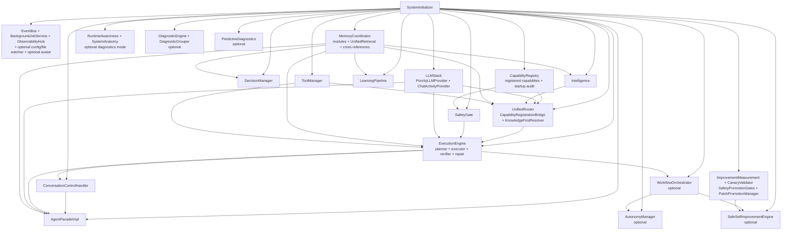

`ToolManager` is a supporting infrastructure collaborator created by the initializer before the capability registry and injected into both the registry bridge and execution engine. `AnswerVerifier` is also created before the learning pipeline and receives that pipeline through late binding. These details are intentionally kept out of the simplified composition diagram and are documented in the ownership and lifecycle sections below.[1]

## 3. Initialization lifecycle

### Construction order

The actual construction order is the following. It is more precise than the historical target diagram because it records the supporting objects and the late-bound edges that the initializer actually uses.[1]

| Order | Constructed or bound component | Code-backed relationship | Runtime classification |
|---:|---|---|---|
| 1 | `EventBus` | Created first and bound through `set_event_bus()` | Canonical infrastructure |
| 2 | `BackgroundJobService`, `ObservabilityHub` | Constructed with the same `EventBus`; compatibility accessors are bound | Canonical infrastructure |
| 3 | Optional avatar, config hot reload, and file watcher | Constructed only when enabled | Supporting/optional |
| 4 | `LLMStack` | Supplies `PriorityLLMProvider` and `ChatActivityProvider`; both are injected into later components | Canonical LLM composition |
| 5 | `MemoryCoordinator` | Constructed with workspace and the shared `EventBus`; owns memory modules and `UnifiedRetrieval` | Canonical memory owner |
| 6 | `ToolManager` | Constructed from the workspace and retained as the canonical tool collaborator | Supporting tool infrastructure |
| 7 | `Intelligence` and `DecisionManager` | Both receive memory services; `DecisionManager` also receives infrastructure | Canonical intelligence/decision services |
| 8 | `CapabilityRegistry` | Receives built-in and extended capabilities, starts, registers `tool_dispatch`, and runs a startup audit | Canonical capability registry |
| 9 | `SafetyGate` | Receives the canonical registry; browser and other guarded adapters are bound to it | Canonical execution safety |
| 10 | `UnifiedRouter` | Receives memory, tools, LLM providers, intelligence, registry, and `LLMStack`; creates the bridge and resolver | Canonical request router |
| 11 | `ExecutionEngine` and `AnswerVerifier` | Both receive the router/LLM/memory path; verifier receives learning later | Canonical execution/answer verification |
| 12 | Optional `WorkflowOrchestrator` | Receives the canonical registry, router, execution engine, safety gate, event bus, and shared jobs | Canonical workflow owner when enabled |
| 13 | `ConversationControlHandler` and `AgentFacadeImpl` | Conversation control receives the execution and routing graph; facade receives injected collaborators only | Canonical public interface |
| 14 | Optional `AutonomyManager` | Constructed with shared infrastructure and late-bound learning | Canonical autonomy owner when enabled |
| 15 | `LearningPipeline` | Constructed with `MemoryCoordinator` and `EventBus`; late-bound into execution, answer verification, research, and autonomy | Canonical learning owner |
| 16 | Optional runtime observation and diagnostics | `RuntimeAwareness`, `SystemAnatomy`, `DiagnosticEngine`, `DiagnosticGrouper`, and `PredictiveDiagnostics` are constructed and subscribed | Optional observation/diagnostic services |
| 17 | Promotion services | Measurement, controlled canary, promotion safety gates, rollback manager, and `PatchPromotionManager` are constructed | Canonical promotion boundary |
| 18 | Optional `SafeSelfImprovementEngine` | Receives workflow, promotion, rollback, measurement, and event dependencies | Canonical self-improvement owner when enabled |
| 19 | Late-bound capability collaborators | Capability adapters are connected to the already-constructed execution, planning, monitoring, safety, memory, learning, and workflow services | Supporting integration |

### Subscription, activation, and readiness

Construction is deliberately separated from activation. The initializer completes late binding, performs the final capability audit, and establishes diagnostic subscriptions before starting services.[1]

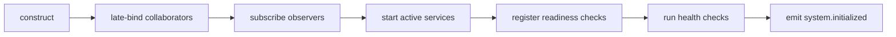

The current activation order is `BackgroundJobService`, `ObservabilityHub` when enabled, optional config/file watcher services, `WorkflowOrchestrator`, `AutonomyManager`, `RuntimeAwareness`, and `PredictiveDiagnostics`. Readiness checks are then registered for the facade, LLM providers, jobs, memory, registry, router, execution, learning, tools, observation, diagnostics, promotion, and bounded shutdown. The initializer runs health checks before returning `InitializedSystem`.[1]

`LearningPipeline` is passive until directly called or started by `AutonomyManager`. When autonomy is enabled, `AutonomyManager.start()` starts the learning pipeline on the shared job service before starting watchdog, self-initiated work, and maintenance components.[5] When autonomy is disabled, the pipeline remains available as an injected synchronous service but no autonomous learning scheduler is started by the initializer.

## 4. Conversation and question routing

The public conversation path is:

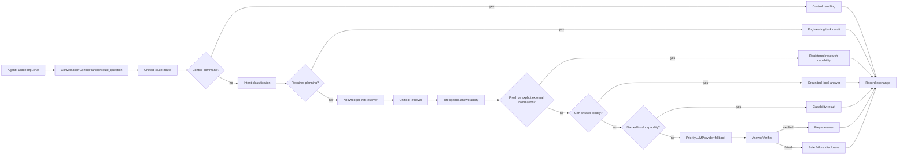

`UnifiedRouter` short-circuits control commands, preserves engineering intents for planning, and delegates question resolution to `KnowledgeFirstResolver`.[3] The resolver reads from `UnifiedRetrieval`, asks `Intelligence` for answerability, routes explicit or fresh information requests to `research_capability`, returns a local answer when answerable, invokes a matching `CapabilityRouter` capability when available, and prepares an LLM fallback with the retrieved evidence retained in context.[4]

`AgentFacadeImpl` returns local answers and capability results directly. Only the fallback branch calls `PriorityLLMProvider.ask_outcome()`. A successful provider response is passed to `AnswerVerifier.verify_fallback_answer()`; provider failure, missing verifier configuration, or failed verification results in safe disclosure rather than an unverified draft.[2] Therefore, the code proves that the intended **knowledge-first behavior currently exists**, with external research taking precedence when the answerability metadata indicates that local evidence would be stale or insufficient.

## 5. Capability execution

The canonical registration and callable path is:

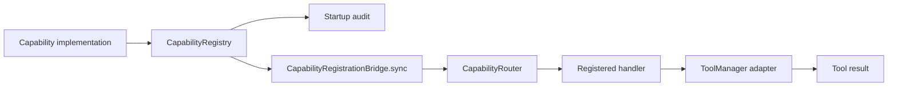

`SystemInitializer` owns the registry, registers built-in and extended capability objects, adds the internal non-discoverable `tool_dispatch` capability, and audits the collaborator requirements. `UnifiedRouter` creates the bridge, synchronizes registry entries into its `CapabilityRouter`, and registers query-facing built-ins through the same bridge.[1][3] The bridge is the proven connection from registry metadata to query routing and ToolManager-backed invocation; a module existing on disk is not sufficient evidence of registration.

Approved tool actions take a more specific route. `ExecutionEngine` uses `_CapabilityToolDispatch` to invoke the named `tool_dispatch` capability through `UnifiedRouter`; the registered handler validates the tool name and arguments and delegates to `ToolManager.execute()`.[1][6] This preserves the distinction between a discoverable user-facing capability and an internal, non-discoverable approved-action bridge.

## 6. Workflow and task execution

Freya has two related but distinct execution surfaces. The public engineering task path uses `ExecutionEngine.execute_plan()`. The composed workflow path uses `WorkflowOrchestrator.execute_workflow()` and its internally initialized `WorkflowComposer` and `TaskExecutor`, while reusing the canonical registry, safety gate, verification runner, and repair loop supplied by the initializer.[1][7]

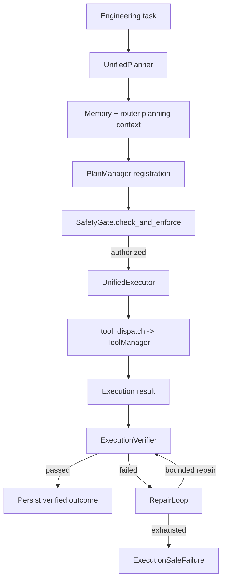

`ExecutionEngine` plans using router-provided knowledge and capability context, registers the plan, checks the plan with `SafetyGate`, executes tasks, verifies the results, attempts bounded repair after verification failure, and persists a final execution record. Both successful and failed terminal outcomes are routed through the execution-learning contract. Failed or unverified work is reported through `ExecutionSafeFailure`; compensation is itself safety-gated.[6]

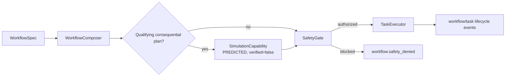

The optional pre-execution simulation is context for the existing safety decision. It cannot approve execution and cannot satisfy post-execution verification.[7] `WorkflowOrchestrator` is also the mandatory workflow and runtime safety boundary for applied safe self-improvement.[7]

## 7. Memory and retrieval architecture

`MemoryCoordinator` is the canonical owner of the memory modules and the single coordinated durable-write facade. During construction it creates WorkingMemory, TaskMemory, LongTermMemory, EpisodicMemory, SemanticMemory, ProjectMemory, ExperienceMemory, EngineeringLessonStorage, GoalStorage, ConversationMemory, `UnifiedRetrieval`, CrossMemoryReferences, ConsolidationEngine, and ForgettingEngine.[8]

| Responsibility | Current owner | Evidence-backed boundary |
|---|---|---|
| Scratch context | `WorkingMemory`, exposed by `MemoryCoordinator` | In-process bounded state; intentionally not durable |
| Task state | `TaskMemory` through `MemoryCoordinator` | Task lifecycle and execution records are coordinated at the facade |
| Durable facts | `LongTermMemory` and `SemanticMemory` | Writes are coordinated and indexed through the memory owner |
| Event history | `EpisodicMemory` | Task completion/failure is recorded by the coordinator |
| Project knowledge | `ProjectMemory` | Used by planning and included in unified retrieval |
| Reusable experience | `ExperienceMemory` | Receives validated experience learning and execution outcomes |
| Engineering lessons | `EngineeringLessonStorage` | Receives skill/lesson learning and execution lessons |
| Goals | `GoalStorage` | Goal reads and writes remain coordinator-owned |
| Conversation history | `ConversationMemory` | Conversation context is exposed through the coordinator boundary |
| Cross-memory links | `CrossMemoryReferences` | Reciprocal links are inferred after canonical durable writes |
| Retrieval | `UnifiedRetrieval` | Read-only aggregation over the memory modules |
| Consolidation/forgetting | `ConsolidationEngine` and `ForgettingEngine` | Supporting memory-maintenance services owned by the coordinator |

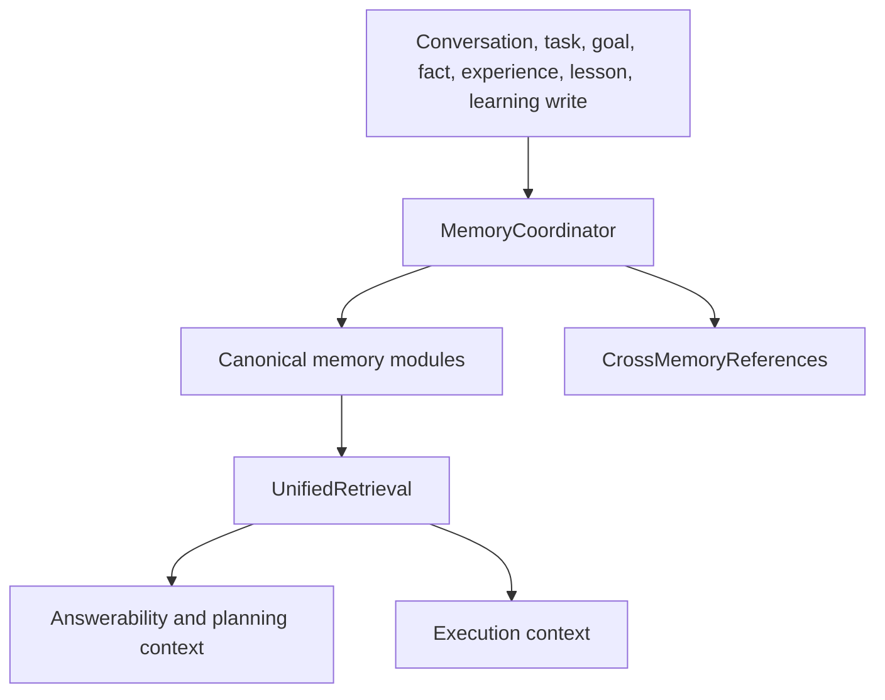

The coordinator exposes planning and execution retrieval methods, bounded conversation context, direct module properties for advanced use, and `store_learned()` for normalized learning. The current project status verifies durable restart behavior for the durable stores and explicitly records WorkingMemory as temporary.[9]

## 8. Learning architecture

The canonical learning pipeline is deterministic local processing; it does not call an LLM. Its stages are Observe, Evaluate, Extract, Validate, Worth Remembering, Classify, Distill, and persist through `MemoryCoordinator`.[10]

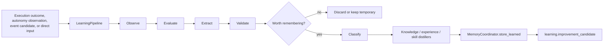

The strongest verified runtime source is `ExecutionVerifier`, which routes both verified success and failure outcomes into `LearningPipeline`. The pipeline also accepts operational observations and event candidates submitted by autonomy/observation adapters; routine or duplicate telemetry is explicitly filtered before durable learning.[10] User feedback and broader legacy decision-learning modules exist in the repository, but this document does not promote them to canonical LearningPipeline inputs without a direct initializer-owned connection.

Durable learning is written through `MemoryCoordinator.store_learned()` in the production path. Validated normalized knowledge, experience, and skill items are mapped to the corresponding canonical stores. Only after storage succeeds does the pipeline emit `learning.improvement_candidate`, which is consumed by the safe self-improvement engine.[8][10]

## 9. Runtime awareness

`RuntimeAwareness` is constructed by the initializer with the canonical orchestrator, `DecisionManager`, `UnifiedRetrieval`, `AutonomyManager`, `GoalStorage`, `EventBus`, and `ObservabilityHub`.[1] It subscribes to orchestrator, workflow, task, decision, goal, autonomy, component, and health events. A private daemon thread periodically gathers current activity, running tasks, active goals, reasoning state, tool usage, resource consumption, system health, memory state, pending work, and autonomous activity. It records metrics and emits `runtime_awareness.updated`.[11]

`SystemAnatomy` is a separate live structural view constructed from `ObservabilityHub`, `CapabilityRegistry`, and `WorkflowOrchestrator`.[1] It supports readiness and diagnostic context; it is not evidence that every class in the repository is a live runtime component.

## 10. Diagnostics

`DiagnosticEngine` analyzes the workspace and publishes `diagnostics.completed` with a summary and issue payloads. The initializer subscribes to that event, converts issue payloads into `DiagnosticEvent` objects, groups them through `DiagnosticGrouper`, and emits `diagnostics.grouped`.[1][12]

`PredictiveDiagnostics` is a separate optional observer. It subscribes to runtime-awareness updates, self-analysis, health changes, component registration, and orchestrator activity. It runs a private polling thread, gathers inputs from RuntimeAwareness, ObservabilityHub, the shared background-job statistics, and optional task-executor statistics, then emits prediction and validation events.[13] When no forecasting model is available, its explicit placeholder result is marked `predicted_state="framework_placeholder"` and `metadata.is_placeholder=true`; this is a current limitation, not a completed forecasting claim.

The verified diagnostic flow is therefore:

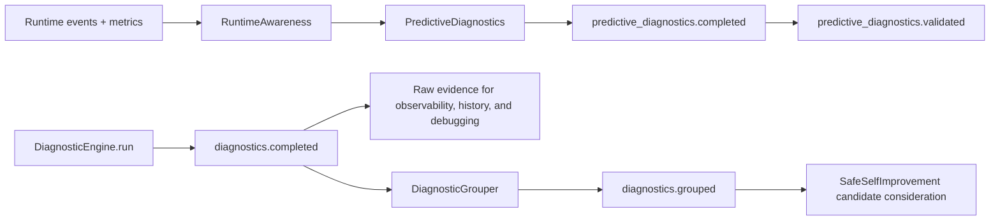

Raw `diagnostics.completed` findings remain available to non-repair consumers. For diagnostic-originated autonomous improvement, `diagnostics.grouped` is the single authoritative input: grouped evidence can produce at most one evidence-preserving candidate per eligible causal group, while unresolved evidence does not trigger speculative repair. If grouping fails, raw diagnostics remain observable and no raw-event repair fallback is enabled.

## 11. Self-improvement architecture

Self-improvement is not a direct `LearningPipeline -> production` path. The initializer constructs a measurement provider, controlled canary validator, promotion safety gates, rollback manager, and `PatchPromotionManager` before it optionally constructs `SafeSelfImprovementEngine`.[1]

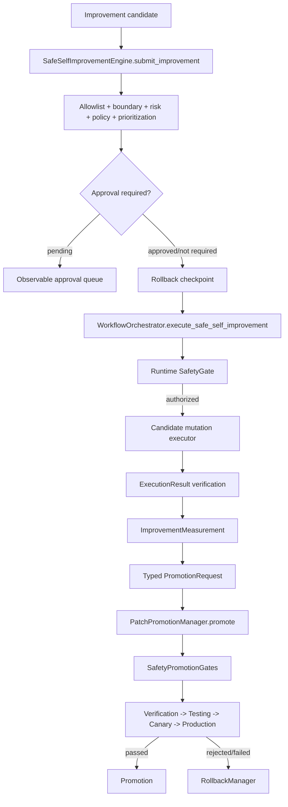

The exact typed evidence package is `PromotionRequest`. It contains candidate identity, `VerificationEvidence`, optional `ImprovementEvidence`, `RollbackEvidence`, and `PromotionProvenance`; validation does not trust arbitrary serialized metadata as a substitute for typed evidence.[14]

`PatchPromotionManager.promote()` is the authoritative promotion boundary. It adapts the legacy call shape only to force it through request construction, validates the request, always evaluates `SafetyPromotionGates`, runs configured verification/testing/canary/production stages, and invokes the rollback manager for validation, safety, stage, or system failures when rollback is configured.[15] `SafetyPromotionGates.evaluate_promotion()` is fail-closed: malformed contexts, evaluator failures, invalid gate output, missing required gates, insufficient confidence, high risk, or missing rollback evidence cannot produce approval.[16]

The initializer wires `CanaryValidator` to a controlled executor that checks candidate identity, runs the canonical verification runner's lint operation, and checks live observability health. The canary is therefore real code-backed validation, but intentionally narrow; it is not a full traffic-splitting deployment system.[1]

## 12. Safety boundaries

Freya has more than one safety boundary, and they must not be conflated.

| Boundary | Authority | Applies to | Result |
|---|---|---|---|
| Runtime `SafetyGate` | `app.orchestrator.safety_gate.SafetyGate` | Plan, task, workflow, capability/tool, compensation, and applied self-improvement actions | Risk assessment, policy decision, approval request, fail-closed block, or authorization |
| `ExecutionVerifier` | `app.verification.execution_verifier.ExecutionVerifier` | Post-execution result evidence | Pass/fail verification and typed execution-learning outcome |
| `AnswerVerifier` | `app.verification.answer_verifier.AnswerVerifier` | Local-model fallback answers | Verified answer or safe failure disclosure |
| `SafetyPromotionGates` | `app.core.safety_gates.SafetyPromotionGates` | Applied self-improvement promotion | Fail-closed promotion decision with gate/risk/evidence evaluation |
| `CanaryValidator` | Initializer-wired controlled validator | Pre-production candidate stage | Controlled lint/health canary evidence |
| `RollbackManager` | Self-improvement and promotion services | Applied changes after rejection/failure | Checkpoint-based rollback attempt |

The runtime `SafetyGate.check_and_enforce()` converts a pending approval into a blocked action until an explicitly approved assessment is supplied. Evaluation failure is also converted into a blocked operation.[17] The promotion safety system is separate and evaluates a typed promotion context after execution and verification.[16]

## 13. Background services and lifecycle ownership

`BackgroundJobService` is the shared scheduler and worker service. It is constructed by the initializer, receives the canonical `EventBus`, and is reused by autonomy and scheduled learning rather than replaced by a second scheduler.[1][18] `WorkflowOrchestrator` owns a coordination thread. `RuntimeAwareness` and `PredictiveDiagnostics` each own a private polling thread. `AutonomyManager` owns the start/stop sequencing of watchdog, self-initiated work, maintenance, and the learning pipeline's shared-job scheduling.[5][7][11][13]

| Active behavior | Current execution mechanism | Owner | Shutdown owner |
|---|---|---|---|
| Scheduled jobs and worker execution | Shared scheduler plus worker threads | `BackgroundJobService` | `SystemInitializer` |
| Workflow coordination/housekeeping | Private daemon thread | `WorkflowOrchestrator` | `SystemInitializer` via orchestrator |
| Runtime polling | Private daemon thread | `RuntimeAwareness` | `SystemInitializer` |
| Predictive polling | Private daemon thread | `PredictiveDiagnostics` | `SystemInitializer` |
| Watchdog/self-initiated/maintenance work | Components started by `AutonomyManager`, using shared jobs where configured | `AutonomyManager` | `SystemInitializer` via autonomy |
| Learning queue drain | Recurring shared job when autonomy starts it | `LearningPipeline` + `BackgroundJobService` | `AutonomyManager` then job service |

## 14. Shutdown lifecycle

The initializer owns shutdown and does not delegate infrastructure ownership to the facade. The current order is:

```mermaid
flowchart LR
    AV[Avatar bridge/runtime] --> AUTO[AutonomyManager]
    AUTO --> SSI[SafeSelfImprovement]
    SSI --> PRED[PredictiveDiagnostics]
    PRED --> AWARE[RuntimeAwareness + accessor reset]
    AWARE --> WF[WorkflowOrchestrator]
    WF --> WATCH[Config hot reload + file watcher]
    WATCH --> OBS[ObservabilityHub]
    OBS --> JOBS[Bounded BackgroundJobService shutdown]
    JOBS --> BUS[EventBus shutdown]
    BUS --> LLM[PriorityLLMProvider shutdown]
    LLM --> CLEAR[Clear infrastructure accessors]
```

The order broadly reverses the dependency and activation flow. It also exposes a lifecycle constraint: event producers and private polling services must be stopped before the shared EventBus is shut down. The initializer stops ObservabilityHub before the bounded job-service shutdown and clears the module-level infrastructure accessors only after the EventBus and provider have stopped.[1] The repository currently records the bounded shutdown budget and accessor cleanup; this architecture task reports lifecycle risks rather than changing them.

## 15. Canonical ownership and compatibility access

| Component | Canonical owner | Classification | Compatibility/global access |
|---|---|---|---|
| `EventBus` | `SystemInitializer` | Canonical infrastructure | Module accessor references initializer-bound instance; reset at shutdown |
| `BackgroundJobService` | `SystemInitializer` | Canonical infrastructure | Accessor can reference the bound service; unbound fallback creation is a second-instance risk |
| `ObservabilityHub` | `SystemInitializer` | Canonical infrastructure | Accessor references initializer-bound instance |
| `LLMStack` and providers | `SystemInitializer` | Canonical LLM composition | Priority-provider compatibility setter references the canonical provider |
| `MemoryCoordinator` | `SystemInitializer` | Canonical memory owner | No parallel durable memory owner is part of the initialized graph |
| `Intelligence` / `DecisionManager` | `SystemInitializer` | Canonical intelligence/decision services | Injected into consumers; not inferred from module names |
| `CapabilityRegistry` | `SystemInitializer` | Canonical registry | Orchestrator receives the same registry; no second production registry is intended |
| `CapabilityRouter` | `UnifiedRouter` | Supporting router | It is the router's internal callable projection of the canonical registry |
| `ToolManager` | `SystemInitializer` | Supporting tool infrastructure | Used by bridge and approved internal dispatch |
| `SafetyGate` | `SystemInitializer` | Canonical runtime safety | Injected into execution, workflow, and guarded capabilities |
| `UnifiedRouter` | `SystemInitializer` | Canonical request router | Public facade and execution planner use the injected router |
| `ExecutionEngine` | `SystemInitializer` | Canonical plan execution | Facade and workflow receive the same engine |
| `WorkflowOrchestrator` | `SystemInitializer` when enabled | Canonical optional workflow owner | Module singleton/accessors are compatibility surfaces, not initializer ownership |
| `ConversationControlHandler` | `SystemInitializer` | Canonical conversation control | Facade delegates to it |
| `AgentFacadeImpl` | `SystemInitializer` | Canonical public facade | Does not own infrastructure shutdown |
| `LearningPipeline` | `SystemInitializer` | Canonical learning owner | Autonomy may start its shared-job processing |
| `RuntimeAwareness` | `SystemInitializer` when diagnostics enabled | Canonical optional observation | `get/set_runtime_awareness` is a compatibility reference |
| Diagnostics/promotion services | `SystemInitializer` | Canonical optional or always-constructed boundary services | Promotion safety accessor references initializer-bound gates |
| Legacy agent and compatibility modules | Various | Compatibility/legacy unless directly injected | Existence alone does not make them current runtime components |

The main architectural rule is therefore **initializer ownership first, accessor second**. Accessors are useful for compatibility, but they must not be mistaken for independent service owners. A future change that calls an unbound fallback accessor can create a second-instance graph and should be treated as a defect.

## 16. Evidence-backed architectural debt

The following items are current debt, not redesign instructions. Each item is included because the code provides a concrete reason that it affects maintainability, lifecycle clarity, or safety interpretation.

| Severity | Finding | Code evidence | Why it matters |
|---|---|---|---|
| MEDIUM | Large composition root | `SystemInitializer.initialize()` constructs and late-binds nearly every service | The canonical graph is clear but difficult to audit and evolve as the component count grows. |
| MEDIUM | Private polling outside shared scheduling | `RuntimeAwareness.start()` and `PredictiveDiagnostics.start()` create private daemon threads | Thread ownership, timing, and shutdown behavior are distributed across services. |
| MEDIUM | Predictive diagnostics can emit placeholders | `_create_placeholder_prediction()` marks framework placeholders explicitly | Consumers must inspect metadata; a placeholder must not be interpreted as a factual forecast. |
| MEDIUM | Compatibility fallback can risk second instances | Background-job and other global accessors support compatibility fallback behavior | An unbound accessor can escape initializer ownership if called during an incomplete or alternate startup. |
| LOW/MEDIUM | Legacy and canonical surfaces coexist | Workflow/orchestrator compatibility singleton and legacy agent modules remain in the tree | New code can accidentally choose a stale path unless it follows the canonical injected graph. |
| LOW | Broad event vocabulary and overlapping observers | Event inventory contains canonical and legacy observers across similar lifecycle topics | It is harder to identify authoritative event edges and avoid duplicate observation work. |
| MEDIUM | Historical documentation drift | Old target/current graphs contain edges not established by the current initializer/router | Agents may implement against stale claims or infer architecture from names. |

No item above was fixed by changing runtime behavior in this documentation task.

## 17. Discrepancy inventory for existing documentation

| Existing claim or document | Current code evidence | Classification |
|---|---|---|
| `TARGET_ARCHITECTURE.md` describes a simplified direct target graph | Initializer includes `DecisionManager`, `ToolManager`, `SafetyGate`, bridge synchronization, late binding, readiness, and optional services absent from the old graph | **STALE / HISTORICAL** |
| Old target names `IntelligenceEngine` and generic `Diagnostics` | Current construction uses `Intelligence`, `DecisionManager`, `DiagnosticEngine`, `DiagnosticGrouper`, and `PredictiveDiagnostics` | **STALE naming and ownership** |
| Old target presents local knowledge, capability, and LLM as a simple chain | `KnowledgeFirstResolver` has a research branch, local answer branch, capability branch, and verified LLM fallback; control/planning intents short-circuit before it | **PARTIALLY CURRENT** |
| Existing `CURRENT_ARCHITECTURE.md` records many canonical owners | Initializer verifies several owners, but the giant graph includes inferred event and lifecycle edges not individually proven | **PARTIALLY CURRENT; replaced with focused evidence views** |
| Existing docs mix construction, activation, readiness, and shutdown | Initializer contains separate code sections for construction, activation, readiness, and shutdown | **DOCUMENTATION DEBT** |
| Project status records durable memory and current capability audits | Those claims are supporting status evidence, while the initializer and production modules remain the architectural source | **PARTIALLY CURRENT / SUPPORTING** |

## 18. Evidence appendix

The appendix records the primary code evidence for major claims. It is intentionally not a line-by-line index.

| Claim | Primary file/module | Class/function | Evidence type |
|---|---|---|---|
| Initializer owns the canonical runtime graph | [`app/core/initializer.py`](https://github.com/bingzwork/Freya/blob/03b0a78/app/core/initializer.py#L95-L751) | `SystemInitializer.initialize` | Construction, injection, activation, return container |
| Top-level runtime is returned explicitly | [`app/core/protocols.py`](https://github.com/bingzwork/Freya/blob/03b0a78/app/core/protocols.py#L158-L207) | `InitializedSystem` | Canonical access container |
| Public facade delegates rather than constructs services | [`app/agent/facade_impl.py`](https://github.com/bingzwork/Freya/blob/03b0a78/app/agent/facade_impl.py#L23-L102) | `AgentFacadeImpl` | Dependency injection and direct invocation |
| Knowledge-first question routing is current | [`app/routing/unified_router.py`](https://github.com/bingzwork/Freya/blob/03b0a78/app/routing/unified_router.py#L86-L269) | `UnifiedRouter.route` | Construction and routing |
| Local retrieval precedes capability and LLM fallback | [`app/routing/knowledge_first_resolver.py`](https://github.com/bingzwork/Freya/blob/03b0a78/app/routing/knowledge_first_resolver.py#L65-L209) | `KnowledgeFirstResolver.resolve` | Direct invocation and decision tree |
| Fallback answers are verified | [`app/agent/facade_impl.py`](https://github.com/bingzwork/Freya/blob/03b0a78/app/agent/facade_impl.py#L131-L177) | `_answer_directly` | Provider invocation and verifier invocation |
| Capability registry is projected through the canonical bridge | [`app/routing/unified_router.py`](https://github.com/bingzwork/Freya/blob/03b0a78/app/routing/unified_router.py#L108-L140) and [`app/capabilities/registration_bridge.py`](https://github.com/bingzwork/Freya/blob/03b0a78/app/capabilities/registration_bridge.py#L52-L140) | `UnifiedRouter`, `CapabilityRegistrationBridge` | Registration and routing |
| Approved tool dispatch reaches ToolManager | [`app/core/initializer.py`](https://github.com/bingzwork/Freya/blob/03b0a78/app/core/initializer.py#L250-L290) and [`app/execution/engine.py`](https://github.com/bingzwork/Freya/blob/03b0a78/app/execution/engine.py#L104-L135) | `tool_dispatch`, `_CapabilityToolDispatch` | Registration and direct invocation |
| Plan execution is safety-gated and verified | [`app/execution/engine.py`](https://github.com/bingzwork/Freya/blob/03b0a78/app/execution/engine.py#L360-L624) | `ExecutionEngine.execute_plan` | Lifecycle state transitions, safety, verification, repair |
| Workflow execution is separately composed but canonical | [`app/orchestrator/workflow_orchestrator.py`](https://github.com/bingzwork/Freya/blob/03b0a78/app/orchestrator/workflow_orchestrator.py#L241-L311) and [`app/orchestrator/workflow_orchestrator.py`](https://github.com/bingzwork/Freya/blob/03b0a78/app/orchestrator/workflow_orchestrator.py#L416-L551) | `execute_workflow`, `execute_safe_self_improvement` | Construction, safety invocation, execution |
| MemoryCoordinator owns modules and retrieval | [`app/memory/coordinator.py`](https://github.com/bingzwork/Freya/blob/03b0a78/app/memory/coordinator.py#L35-L82) | `MemoryCoordinator.__init__` | Construction and ownership |
| Durable writes and cross-memory references are coordinated | [`app/memory/coordinator.py`](https://github.com/bingzwork/Freya/blob/03b0a78/app/memory/coordinator.py#L135-L357) | write methods and `store_learned` | Mutation authority and event emission |
| Learning is validated before memory persistence | [`app/learning/pipeline.py`](https://github.com/bingzwork/Freya/blob/03b0a78/app/learning/pipeline.py#L208-L244) and [`app/learning/pipeline.py`](https://github.com/bingzwork/Freya/blob/03b0a78/app/learning/pipeline.py#L614-L791) | `LearningPipeline.run`, persistence | Direct invocation and event publication |
| Runtime awareness is event-driven plus polling | [`app/self_observation/runtime_awareness.py`](https://github.com/bingzwork/Freya/blob/03b0a78/app/self_observation/runtime_awareness.py#L146-L198) and [`app/self_observation/runtime_awareness.py`](https://github.com/bingzwork/Freya/blob/03b0a78/app/self_observation/runtime_awareness.py#L200-L283) | subscription, lifecycle, `update_awareness` | Event subscription, private thread, metrics, publication |
| Diagnostics are grouped after `DiagnosticEngine` completion | [`app/core/initializer.py`](https://github.com/bingzwork/Freya/blob/03b0a78/app/core/initializer.py#L442-L486) and [`app/diagnostics/diagnostic_engine.py`](https://github.com/bingzwork/Freya/blob/03b0a78/app/diagnostics/diagnostic_engine.py#L73-L116) | initializer subscription, `DiagnosticEngine.run` | Event subscription and publication |
| Predictive diagnostics has a private loop and placeholders | [`app/self_observation/predictive_diagnostics.py`](https://github.com/bingzwork/Freya/blob/03b0a78/app/self_observation/predictive_diagnostics.py#L289-L361) and [`placeholder implementation`](https://github.com/bingzwork/Freya/blob/03b0a78/app/self_observation/predictive_diagnostics.py#L723-L809) | subscription/lifecycle/placeholder | Event subscription, private thread, explicit limitation |
| Learning and diagnostics feed self-improvement | [`app/safe_self_improvement/self_improvement.py`](https://github.com/bingzwork/Freya/blob/03b0a78/app/safe_self_improvement/self_improvement.py#L159-L465) | `submit_improvement` | Event input, workflow invocation, evidence assembly |
| Promotion uses a typed request | [`app/safe_self_improvement/promotion_contract.py`](https://github.com/bingzwork/Freya/blob/03b0a78/app/safe_self_improvement/promotion_contract.py#L18-L240) | `PromotionRequest` and evidence types | Typed validation |
| Promotion boundary is fail-closed | [`app/safe_self_improvement/promotion.py`](https://github.com/bingzwork/Freya/blob/03b0a78/app/safe_self_improvement/promotion.py#L130-L316) and [`app/core/safety_gates.py`](https://github.com/bingzwork/Freya/blob/03b0a78/app/core/safety_gates.py#L416-L747) | `PatchPromotionManager.promote`, `SafetyPromotionGates.evaluate_promotion` | Validation, safety evaluation, stages, rollback |
| Runtime safety blocks pending approval | [`app/orchestrator/safety_gate.py`](https://github.com/bingzwork/Freya/blob/03b0a78/app/orchestrator/safety_gate.py#L371-L573) | `assess`, `check_and_enforce` | Approval, fail-closed enforcement, events |
| Shutdown is initializer-owned and bounded | [`app/core/initializer.py`](https://github.com/bingzwork/Freya/blob/03b0a78/app/core/initializer.py#L1103-L1177) | `SystemInitializer.shutdown` | Lifecycle ownership and accessor cleanup |

## References

[1]: https://github.com/bingzwork/Freya/blob/03b0a78/app/core/initializer.py "SystemInitializer"
[2]: https://github.com/bingzwork/Freya/blob/03b0a78/app/agent/facade_impl.py "AgentFacadeImpl"
[3]: https://github.com/bingzwork/Freya/blob/03b0a78/app/routing/unified_router.py "UnifiedRouter"
[4]: https://github.com/bingzwork/Freya/blob/03b0a78/app/routing/knowledge_first_resolver.py "KnowledgeFirstResolver"
[5]: https://github.com/bingzwork/Freya/blob/03b0a78/app/autonomy/manager.py "AutonomyManager"
[6]: https://github.com/bingzwork/Freya/blob/03b0a78/app/execution/engine.py "ExecutionEngine"
[7]: https://github.com/bingzwork/Freya/blob/03b0a78/app/orchestrator/workflow_orchestrator.py "WorkflowOrchestrator"
[8]: https://github.com/bingzwork/Freya/blob/03b0a78/app/memory/coordinator.py "MemoryCoordinator"
[9]: https://github.com/bingzwork/Freya/blob/03b0a78/PROJECT_STATUS.md "Project status and durable-memory evidence"
[10]: https://github.com/bingzwork/Freya/blob/03b0a78/app/learning/pipeline.py "LearningPipeline"
[11]: https://github.com/bingzwork/Freya/blob/03b0a78/app/self_observation/runtime_awareness.py "RuntimeAwareness"
[12]: https://github.com/bingzwork/Freya/blob/03b0a78/app/diagnostics/diagnostic_engine.py "DiagnosticEngine"
[13]: https://github.com/bingzwork/Freya/blob/03b0a78/app/self_observation/predictive_diagnostics.py "PredictiveDiagnostics"
[14]: https://github.com/bingzwork/Freya/blob/03b0a78/app/safe_self_improvement/promotion_contract.py "PromotionRequest"
[15]: https://github.com/bingzwork/Freya/blob/03b0a78/app/safe_self_improvement/promotion.py "PatchPromotionManager"
[16]: https://github.com/bingzwork/Freya/blob/03b0a78/app/core/safety_gates.py "SafetyPromotionGates"
[17]: https://github.com/bingzwork/Freya/blob/03b0a78/app/orchestrator/safety_gate.py "SafetyGate"
[18]: https://github.com/bingzwork/Freya/blob/03b0a78/app/core/background_jobs.py "BackgroundJobService"
