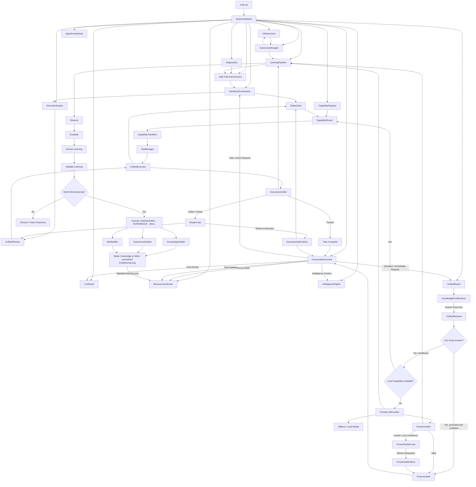

# Current Freya Architecture

*Reconciled with `TARGET_ARCHITECTURE.md` and the codebase at commit `470fd7a` on 2026-08-14.*

This document preserves the target architecture’s component names, ownership, and control-flow boundaries. It does not introduce replacement components or a parallel runtime design. The implementation status below distinguishes existing wiring from remaining MVP fixes.

## Target-preserving runtime wiring

## Component responsibilities

| Target component | Current code location | Responsibility |
|---|---|---|
| `SystemInitializer` | `app/core/initializer.py` | Constructs the target runtime in dependency order. |
| `AgentFacadeImpl` | `app/agent/facade_impl.py` | Public interface for chat, task execution, status, and shutdown. |
| `ConversationControl` | `app/conversational_control.py` | Handles user control commands and active task state. |
| `MemoryCoordinator` | `app/memory/coordinator.py` | Owns coordinated memory stores and canonical memory writes. |
| `UnifiedRetrieval` | `app/memory/unified_retrieval.py` | Searches Freya’s internal memory sources through one retrieval contract. |
| `IntelligenceEngine` | `app/intelligence/intelligence.py` | Provides reasoning, confidence/answerability, and context/goal awareness. |
| `UnifiedRouter` | `app/routing/unified_router.py` | Routes questions through `KnowledgeFirstResolver`, capabilities, or fallback. |
| `KnowledgeFirstResolver` | `app/routing/knowledge_first_resolver.py` | Searches local knowledge first and chooses answer, capability, or fallback. |
| `CapabilityRegistry` | `app/orchestrator/capability_registry.py` | Registers callable capabilities and their declared actions. |
| `CapabilityRouter` | `app/capabilities/router.py` | Selects matching capability handlers. |
| `Capability Handlers` | `app/capabilities/handlers.py` and orchestrator capabilities | Execute registered local capabilities. |
| `ToolManager` | `app/core/tool_manager.py` | Executes tools after routing and safety approval. |
| `LLMStack` | `app/core/llm_stack.py` | Owns the local-model provider and chat activity provider. |
| `PriorityLLMProvider` | `app/core/priority_llm.py` | Provides local-model fallback drafts. |
| `AnswerVerifier` | `app/verification/answer_verifier.py` | Decides whether a fallback answer is safe to return or repair. |
| `AnswerRepairLoop` / `AnswerSafeFailure` | `app/verification/answer_repair_loop.py` and verifier module | Retries invalid drafts within policy and discloses safe failure when exhausted. |
| `WorkflowOrchestrator` | `app/orchestrator/workflow_orchestrator.py` | Coordinates workflow planning and execution behind the safety gate. |
| `ExecutionEngine` | `app/execution/engine.py` | Plans, executes, verifies, repairs, and reports task outcomes. |
| `UnifiedPlanner` / `UnifiedExecutor` | planner and execution modules | Build and dispatch approved execution work. |
| `ExecutionVerifier` / `RepairLoop` | `app/verification/execution_verifier.py` and repair modules | Verify execution and perform bounded repair/replan. |
| `LearningPipeline` | `app/learning/pipeline.py` | Promotes only validated learning through the target stages. |
| `KnowledgeDistiller`, `ExperienceDistiller`, `SkillDistiller` | `app/learning/distillers.py` | Normalize the three target learning types. |
| `AutonomyManager` / `Watchdog` | `app/autonomy` and self-observation modules | Submit autonomous work and observations through the existing workflow and learning paths. |
| `Diagnostics` / `Safe Self-Improvement` | diagnostics and safe-self-improvement modules | Produce and evaluate improvement proposals behind target safety boundaries. |
| `Infrastructure` | event, background-job, and observability modules | Supplies `EventBus`, `BackgroundJobService`, and `ObservabilityHub`. |

## Target flow status

The target local-first question path is implemented through `AgentFacadeImpl` → `ConversationControl` → `UnifiedRouter` → `KnowledgeFirstResolver` → `UnifiedRetrieval`. When internal knowledge is sufficient, the resolver returns `Freya Answer`. When it is insufficient, the resolver checks the existing capability path before preparing a `PriorityLLMProvider` fallback.

The fallback now carries the retrieval evidence already collected by `UnifiedRetrieval` into `AnswerVerifier` through the existing route context. The verifier requires evidence grounding on this target fallback path, and invalid or low-confidence output continues through `AnswerRepairLoop` and `AnswerSafeFailure`; no new verifier or router has been introduced.

The target action path remains `WorkflowOrchestrator` → `SafetyGate` → `ExecutionEngine` → `UnifiedPlanner` → `UnifiedExecutor` → `ExecutionVerifier`, with bounded `RepairLoop` behavior and `ExecutionSafeFailure` for exhausted retries. The target learning path remains the sole promotion route: `Observe` → `Evaluate` → `Extract Learning` → `Validate Learning` → `Worth Remembering?` → classification and distillation → validated write through `MemoryCoordinator`.

## Known target-aligned limitations

The current implementation still requires MVP hardening in capability registration consistency, claim-level rather than lexical answer grounding, end-to-end acceptance coverage, execution compensation, autonomy event deduplication, and safe self-improvement integration. These are implementation fixes within the existing target components and edges, not reasons to redesign the architecture.

The legacy `FreyaAgent`, older autonomy modules, and experimental retrieval implementations remain in the repository but are not part of the target’s canonical initialized path. They are not represented as replacement architecture here.

See [`PROJECT_STATUS.md`](PROJECT_STATUS.md) for the prioritized fix list.
