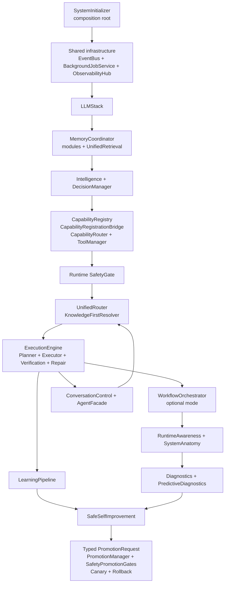

# Freya Target Architecture

**Status:** Intended next-state direction

**Baseline:** Current implemented V2 documented in [`CURRENT_ARCHITECTURE.md`](CURRENT_ARCHITECTURE.md)

**Repository revision used for this baseline:** `03b0a78`

> This document describes Freya's intended architectural direction.
>
> `CURRENT_ARCHITECTURE.md` describes implemented runtime reality.
>
> When documentation and production code disagree, do not automatically refactor code to match documentation. Inspect the discrepancy, determine whether the code or documentation is stale, and report the mismatch before making architectural changes.

## 1. Scope and design rule

The target is **Current V2 plus clearly justified intentional improvements**. It is not a replacement architecture. The initializer-owned graph, local-first routing, canonical memory owner, capability registry and bridge, workflow/execution separation, fail-closed safety, evidence-based learning, and typed promotion boundary remain the foundation.

The target document must never be used as evidence that a component or edge already exists. Implementation status is always read from the production code and from `CURRENT_ARCHITECTURE.md` after a fresh verification pass.

## 2. Target invariants

Freya should continue to maintain the following invariants:

| Invariant | Target meaning |
|---|---|
| Local knowledge first | Retrieval and answerability precede LLM fallback for question handling. |
| Canonical runtime ownership | `SystemInitializer` constructs one authoritative instance of each core service. |
| One memory write boundary | Durable learning and memory mutations remain coordinated by `MemoryCoordinator`. |
| Capabilities separate from orchestration | Capabilities declare callable behavior; workflows compose and execute them. |
| Execution separate from verification | Actions may produce results, but only verification establishes an accepted outcome. |
| Observation separate from diagnosis | Runtime measurements and lifecycle events are inputs; diagnostic analysis is a distinct boundary. |
| Diagnosis separate from repair authority | Diagnostics may produce candidates or reports; they do not directly mutate production. |
| Verification separate from promotion | Verification evidence is necessary but is not itself a promotion decision. |
| Promotion fail-closed | Invalid evidence, failed gates, unacceptable risk, or missing rollback capability cannot approve a change. |
| Learning from outcomes | Verified success and failure outcomes may enter the validated learning pipeline. |
| Provenance preserved | Candidate identity, verification, measurement, rollback, and promotion provenance remain linked. |
| UI/avatar isolated from backend core | Avatar and UI bridges observe or present runtime state without becoming backend owners. |

## 3. Target composition

The intended composition remains the current graph, with explicit boundaries and no parallel owners.



The diagram is intentionally smaller than the historical target. Internal construction details, optionality, readiness, and shutdown remain documented in the current architecture because the target must not pretend that a future simplification has already happened.

## 4. KEEP — current V2 behavior that should remain

| Area | Keep | Reason |
|---|---|---|
| Composition | Initializer-owned construction, late binding, final audit, readiness registration, and centralized shutdown | This is the verified ownership spine. |
| Question routing | `UnifiedRouter` plus `KnowledgeFirstResolver` with local retrieval, external research, capability routing, and verified local-model fallback | This is the actual local-first behavior. |
| Capability integration | One registry projected through `CapabilityRegistrationBridge` into `CapabilityRouter` and ToolManager-backed handlers | It avoids parallel registries and preserves auditability. |
| Memory | `MemoryCoordinator` as the single coordinated write facade and `UnifiedRetrieval` as the read aggregation path | It keeps storage, retrieval, cross-memory references, and learning writes distinct. |
| Execution | `ExecutionEngine`, `WorkflowOrchestrator`, `SafetyGate`, `ExecutionVerifier`, `RepairLoop`, and safe-failure reporting | It separates action authorization, execution, verification, repair, and reporting. |
| Learning | Deterministic validation/distillation before `MemoryCoordinator` persistence | It prevents raw or unverified output from becoming durable learning. |
| Observation | `RuntimeAwareness`, `SystemAnatomy`, `ObservabilityHub`, and event-driven diagnostic consumers | It makes current runtime state measurable without giving observers mutation authority. |
| Self-improvement | Workflow-gated application followed by typed evidence, promotion gates, canary validation, and rollback | It preserves a fail-closed promotion boundary. |
| Safety | Runtime SafetyGate and promotion SafetyPromotionGates remain separate | Execution authorization and patch promotion answer different safety questions. |

## 5. FORMALIZE — current behavior that needs clearer contracts

These are not new subsystems. They are contracts that already exist in code and should be made more explicit through tests, type-level documentation, readiness metadata, or focused design notes.

| Contract to formalize | Existing evidence | Intended clarification |
|---|---|---|
| Initializer ownership | `SystemInitializer` constructs and returns the graph | State that module-level accessors are compatibility references, never the canonical owner. |
| Optional subsystem semantics | Orchestrator, autonomy, diagnostics, avatar, watcher, hot reload, and self-improvement are configuration-controlled | Document which services are passive when disabled and what readiness means in each mode. |
| Capability admission | Registry startup audit and late binding already validate collaborator requirements | Make the registration-to-router projection and late-registration requirement explicit. |
| Correlation propagation | Router and workflow code attach request/workflow identifiers | Define the minimum identifier fields retained through capability, job, safety, verification, learning, and promotion events. |
| Evidence boundaries | `PromotionRequest` separates verification, improvement, rollback, and provenance evidence | Keep typed evidence authoritative and reject metadata-only substitutes. |
| Simulation semantics | Workflow pre-execution simulation marks output `PREDICTED` and `verified=false` | Keep prediction context separate from authorization and post-execution verification. |
| Readiness | Initializer registers target-path, diagnostics, self-improvement, and lifecycle checks | Keep readiness as a runtime report, not as a second service registry. |
| Documentation maintenance | Current and target documents now have separate roles | Require code evidence before adding a current-architecture edge. |

## 6. FIX — evidence-backed defects or risks

The following changes are justified because the current code exposes concrete lifecycle or interpretation risk. They should be implemented as focused changes with regression coverage, not as a broad rewrite.

| Priority | Fix | Evidence and acceptance condition |
|---|---|---|
| Medium | Remove or contain unbound accessor fallback creation | `BackgroundJobService` and similar compatibility accessors can create or expose a service outside initializer ownership. Acceptance: unbound access fails clearly or requires an explicit test-only factory; production startup retains one canonical instance. |
| Medium | Make private polling ownership and shutdown semantics explicit | `RuntimeAwareness` and `PredictiveDiagnostics` own private daemon threads. Acceptance: readiness exposes running state, stop joins are bounded, and shutdown tests prove no thread survives the initializer lifecycle. |
| Medium | Prevent placeholder predictive results from being treated as forecasts | Predictive diagnostics explicitly emits framework placeholders when no model exists. Acceptance: consumers and reports must distinguish placeholder, prediction, and validated outcome states. |
| Medium | Add focused lifecycle tests for event-bus shutdown ordering | Shutdown stops observability and jobs before the EventBus. Acceptance: producers are stopped/unsubscribed before EventBus shutdown, and shutdown remains within the configured budget. |
| Low/Medium | Reduce ambiguity between canonical and compatibility orchestration paths | A workflow singleton and legacy modules coexist with injected runtime ownership. Acceptance: new production call sites use initializer-injected services and compatibility paths are marked or tested as adapters. |
| Low | Normalize high-value event vocabulary | The repository contains overlapping legacy and canonical event names. Acceptance: architecture-critical events have documented producers, consumers, and payload identity fields. |

## 7. REMOVE — confirmed legacy or duplicate structures, only after migration proof

Removal is conditional. Nothing in this section should be deleted merely because it is old or conceptually similar. Each item requires a repository-wide call-site audit, compatibility plan, focused tests, and an explicit migration decision.

| Candidate for eventual removal | Current status | Removal condition |
|---|---|---|
| Legacy agent-owned collaborators that are not injected into `InitializedSystem` | Compatibility or legacy unless proven otherwise | No production call sites, no public compatibility promise, and replacement behavior covered by canonical services. |
| Duplicate orchestration singleton access paths | Compatibility surface around initializer-owned workflow orchestration | All production call sites use injected `WorkflowOrchestrator`; compatibility consumers have an explicit adapter or are retired. |
| Metadata-only promotion evidence mirrors | Compatibility serialization retained beside typed evidence | All consumers use typed `PromotionRequest` evidence and serialized fields are no longer used for decisions. |
| Stale architecture diagrams and historical target claims | Archived in `docs/archive/TARGET_ARCHITECTURE_V1.md` | Keep the archive for history; remove only if repository policy explicitly permits historical deletion. |

## 8. FUTURE — desired behavior not yet proven to exist

These are intentionally future items. They are not current runtime claims.

| Future item | Why it is future | Constraint |
|---|---|---|
| Shared scheduling for runtime-awareness and predictive polling | Current services own private polling threads | Any replacement must preserve bounded shutdown, readiness, event ordering, and no duplicate scheduler. |
| A fully realized forecasting model | Current predictive diagnostics can return explicit framework placeholders | Never label placeholders as predictions; retain validation against actual outcomes. |
| Automatic safe projection of late-registered capabilities | Current late registration requires explicit bridge synchronization | Extend the existing registry/bridge/audit path; do not add a second router or registry. |
| Operator control surface | Project status identifies this as future growth | Use canonical readiness, correlation, approval, workflow, and capability APIs. |
| Scenario benchmarks and regression dashboards | Project status identifies benchmark/reporting work as future growth | Measure grounded answers, capability execution, provider outage recovery, and learning quality without changing ownership. |
| Mature autonomous policy and review queues | Current autonomy is bounded but not a full operator policy product | Preserve budgets, correlation, explicit approval, and pause/review behavior. |

## 9. Target runtime paths

The target keeps the verified paths below. It does not introduce replacement names for current owners.

### Conversation

```text
AgentFacadeImpl
→ ConversationControlHandler
→ UnifiedRouter
→ UnifiedRouter control/planning decision
→ KnowledgeFirstResolver
→ UnifiedRetrieval + Intelligence
→ local answer OR registered research/capability OR verified PriorityLLM fallback
→ AnswerVerifier or safe failure
→ conversation record through MemoryCoordinator boundary
```

### Capability execution

```text
Capability implementation
→ CapabilityRegistry
→ startup audit / CapabilityRegistrationBridge
→ CapabilityRouter
→ registered handler
→ ToolManager
```

For approved actions, `tool_dispatch` remains the internal bridge and is still subject to the runtime workflow and SafetyGate path. No direct capability-owned mutation bypass is part of the target.

### Workflow and execution

```text
WorkflowOrchestrator or ExecutionEngine
→ planning/composition
→ optional predicted simulation context
→ runtime SafetyGate
→ executor / TaskExecutor
→ ExecutionVerifier
→ bounded repair or safe failure
→ LearningPipeline outcome
```

Simulation remains prediction only. It does not authorize work or satisfy verification.

### Memory and learning

```text
observed outcome or candidate
→ LearningPipeline
→ validation / worth remembering
→ classification / distillation
→ MemoryCoordinator
→ canonical memory store and UnifiedRetrieval
→ improvement-candidate event only after successful persistence
```

### Self-improvement

```text
learning or diagnostic candidate
→ SafeSelfImprovementEngine validation and approval
→ rollback checkpoint
→ WorkflowOrchestrator + runtime SafetyGate
→ candidate execution and verification
→ ImprovementMeasurement
→ typed PromotionRequest
→ PatchPromotionManager
→ SafetyPromotionGates
→ verification/testing/canary/production
→ promotion or rollback
```

## 10. Target lifecycle rule

The target lifecycle remains:

```text
construct
→ inject
→ subscribe
→ audit
→ activate
→ readiness
→ operate
→ stop active producers
→ stop shared jobs
→ stop EventBus/providers
→ clear compatibility accessors
```

Any future lifecycle change must demonstrate that no event producer, private polling thread, or compatibility accessor continues to use a stopped shared service. Lifecycle changes should be verified with focused clean-process tests before broad refactoring.

## 11. Change governance

Architecture changes should be proposed against the current code, not against this target document alone. A proposed change must identify the canonical owner, the construction/injection edge, the activation and shutdown owner, the safety boundary, the verification evidence, and the compatibility impact. A new registry, memory system, scheduler, executor, router, or promotion path requires explicit architectural approval because it would violate the one-owner invariants above.

Production code must not be refactored merely to make a stale document look correct. When a discrepancy is found, first classify it as code drift, documentation drift, or an intentional compatibility surface. Then update the appropriate document or open a focused implementation change with tests.

## References

[1]: https://github.com/bingzwork/Freya/blob/03b0a78/CURRENT_ARCHITECTURE.md "Freya current implemented architecture"
[2]: https://github.com/bingzwork/Freya/blob/03b0a78/PROJECT_STATUS.md "Project status and future growth priorities"
[3]: https://github.com/bingzwork/Freya/blob/03b0a78/app/core/initializer.py "SystemInitializer"
[4]: https://github.com/bingzwork/Freya/blob/03b0a78/app/routing/unified_router.py "UnifiedRouter"
[5]: https://github.com/bingzwork/Freya/blob/03b0a78/app/routing/knowledge_first_resolver.py "KnowledgeFirstResolver"
[6]: https://github.com/bingzwork/Freya/blob/03b0a78/app/execution/engine.py "ExecutionEngine"
[7]: https://github.com/bingzwork/Freya/blob/03b0a78/app/orchestrator/workflow_orchestrator.py "WorkflowOrchestrator"
[8]: https://github.com/bingzwork/Freya/blob/03b0a78/app/memory/coordinator.py "MemoryCoordinator"
[9]: https://github.com/bingzwork/Freya/blob/03b0a78/app/learning/pipeline.py "LearningPipeline"
[10]: https://github.com/bingzwork/Freya/blob/03b0a78/app/safe_self_improvement/promotion_contract.py "PromotionRequest"
[11]: https://github.com/bingzwork/Freya/blob/03b0a78/app/safe_self_improvement/promotion.py "PatchPromotionManager"
[12]: https://github.com/bingzwork/Freya/blob/03b0a78/app/core/safety_gates.py "SafetyPromotionGates"
[13]: https://github.com/bingzwork/Freya/blob/03b0a78/app/orchestrator/safety_gate.py "SafetyGate"
[14]: https://github.com/bingzwork/Freya/blob/03b0a78/app/self_observation/runtime_awareness.py "RuntimeAwareness"
[15]: https://github.com/bingzwork/Freya/blob/03b0a78/app/self_observation/predictive_diagnostics.py "PredictiveDiagnostics"
